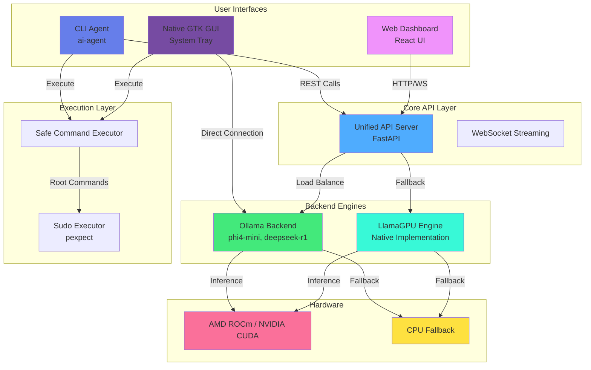
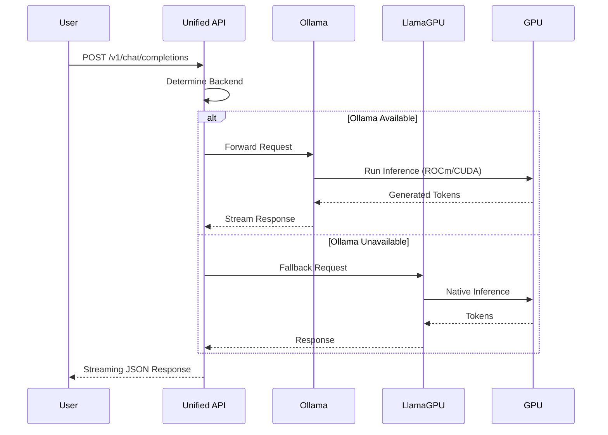
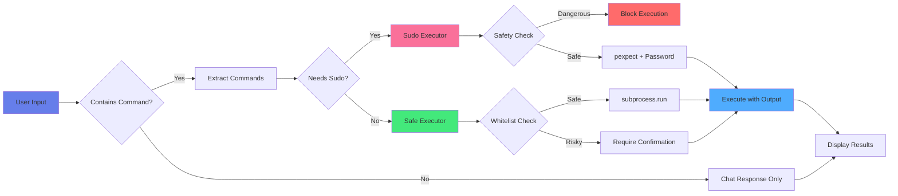

# 🚀 Llama-GPU

<div align="center">

**A Production-Ready Multi-Backend LLM Inference Platform**

*Seamless integration with Ollama, flexible command execution, and native Ubuntu desktop GUI*

[](https://github.com/hkevin01/Llama-GPU/actions)
[](https://codecov.io/gh/hkevin01/Llama-GPU)
[](LICENSE)
[](https://www.python.org/downloads/)
[](https://rocmdocs.amd.com/)
[](https://ollama.ai/)

</div>

---

## � Table of Contents

- [Overview](#-overview)
- [Architecture](#-architecture)
- [Features](#-features)
- [Installation](#-installation)
- [Quick Start](#-quick-start)
- [Technology Stack](#-technology-stack)
- [Project Structure](#-project-structure)
- [API Documentation](#-api-documentation)
- [Development](#-development)
- [Contributing](#-contributing)
- [License](#-license)

---

## 🎯 Overview

Llama-GPU is a comprehensive LLM inference platform that bridges the gap between local AI models and production applications. It provides multiple interfaces (CLI, GUI, API) for interacting with language models, with special optimizations for AMD ROCm GPUs and seamless Ollama integration.

### 🎭 Why Llama-GPU?

| Challenge | Solution |
|-----------|----------|
| **Multiple LLM Backends** | Unified API supporting Ollama, LlamaGPU, and custom backends |
| **Complex Setup** | One-command installation with automatic GPU detection |
| **Limited Interfaces** | CLI, Native GUI, Web Dashboard, and REST API |
| **AMD GPU Support** | Optimized for ROCm with gfx1030 (RX 5600 XT) safeguards |
| **Command Execution** | Safe AI-powered terminal commands with sudo capability |
| **Developer Experience** | Hot-reload, comprehensive logging, and debugging tools |

---

## 🏗️ Architecture

### System Overview



### Multi-Backend Architecture



### Command Execution Flow



---

## ✨ Features

### 🎨 Multiple Interfaces

| Interface | Technology | Use Case |
|-----------|-----------|----------|
| **Native GUI** | GTK3 + AppIndicator3 | System tray integration, always accessible |
| **CLI Agent** | Python + OllamaClient | Terminal workflows, automation, scripting |
| **Web Dashboard** | React + FastAPI | Remote access, monitoring, team collaboration |
| **REST API** | FastAPI + OpenAPI | Application integration, microservices |

### 🔧 Backend Engines

#### **Ollama Integration** 
*Why: Production-ready, optimized model serving*

- **Technology**: HTTP REST client with streaming support
- **Models Supported**: phi4-mini (2.5GB), deepseek-r1 (4.7GB), llama3, mistral
- **Performance**: 1-3s response time on phi4-mini
- **Implementation**: Custom OllamaClient with connection pooling

**How it works:**
1. Detects Ollama service on port 11434
2. Lists available models via `/api/tags`
3. Streams responses using `/api/generate` or `/api/chat`
4. Automatically handles model loading and caching

#### **LlamaGPU Native Engine**
*Why: Direct GPU control, maximum customization*

- **Technology**: PyTorch + ROCm/CUDA backends
- **Optimization**: FP16 quantization, KV-cache management
- **GPU Support**: AMD gfx1030-1100, NVIDIA Compute 7.0+
- **Fallback**: Automatic CPU mode when GPU unavailable

**Implementation Details:**
- Uses `torch.cuda.is_available()` for GPU detection
- Implements safeguards for problematic AMD gfx1030 (RX 5600 XT)
- Memory management with `torch.cuda.empty_cache()`
- Supports streaming via Python generators

### 💻 Command Execution System

#### **Safe Command Executor**
*Why: AI needs to interact with the system safely*

- **Technology**: Python subprocess + safety validation
- **Safety Levels**: Whitelist, Blacklist, Confirmation Required
- **Blocked Commands**: `rm -rf /`, `dd`, `mkfs`, fork bombs
- **Output Handling**: Real-time streaming, truncation for large outputs

**Security Model:**
```python
SAFE_COMMANDS = ['ls', 'pwd', 'cat', 'grep', 'find']  # No confirmation
DANGEROUS_COMMANDS = ['rm -rf /', 'dd', 'mkfs']        # Always blocked
ROOT_COMMANDS = ['apt', 'systemctl', 'mount']          # Require sudo
```

#### **Sudo Executor with pexpect**
*Why: Some operations require elevated privileges*

- **Technology**: pexpect for interactive password handling
- **Features**: Password caching, confirmation prompts, timeout management
- **Safety**: Extra confirmation for high-risk commands
- **Use Cases**: System updates, service management, configuration changes

**Flow:**
1. Detect sudo requirement (command prefix or whitelist)
2. Prompt for password (cached for session)
3. Execute with `sudo -S` (stdin password)
4. Parse output in real-time
5. Return structured result (exit code, stdout, stderr)

### 🎮 AMD ROCm Optimization

#### **GPU Detection & Safeguards**
*Why: AMD RDNA1/RDNA2 GPUs need special handling*

- **Problematic GPUs**: gfx1030 (RX 5600 XT), gfx1031, gfx1032
- **Detection Method**: Parse `rocminfo`, check environment variables
- **Safeguards**: Automatic CPU fallback, warning messages
- **Override**: `--force-gpu-unsafe` flag for power users

**Environment Variables:**
```bash
HSA_OVERRIDE_GFX_VERSION=10.3.0       # RDNA architecture compatibility
MIOPEN_DEBUG_CONV_IMPLICIT_GEMM=1     # Fix Conv2d operations
PYTORCH_ROCM_ARCH=gfx1030             # Explicit architecture
```

**Recommended Configuration:**
- ROCm 5.2 + PyTorch 1.13.1 for RDNA1/RDNA2
- ROCm 6.x for RDNA3 (gfx1100+)
- CPU backend for unsupported architectures

### 📊 Benchmarking & Diagnostics

#### **Model Comparison Tool**
*Why: Choose the right model for your use case*

- **Metrics**: Response time, tokens/sec, throughput, memory usage
- **Models**: phi4-mini, deepseek-r1, llama3, custom models
- **Output**: JSON reports, formatted tables, graphs
- **Automation**: CI/CD integration, performance regression detection

#### **GPU Diagnostics**
*Why: Troubleshoot hardware/driver issues*

- **Checks**: ROCm installation, PyTorch compatibility, Ollama status
- **Reports**: GPU architecture, driver version, available models
- **Recommendations**: Environment variables, version upgrades, workarounds

### 🔐 Security Features

| Feature | Implementation | Purpose |
|---------|---------------|----------|
| **Command Validation** | Regex + whitelist/blacklist | Prevent malicious commands |
| **Sudo Confirmation** | Interactive prompts | User awareness for root operations |
| **Dangerous Command Blocking** | Hard-coded blacklist | Protect against system damage |
| **Output Truncation** | 5000 char limit | Prevent memory exhaustion |
| **Session Timeout** | 300s default | Prevent hanging processes |
| **API Key Support** | Bearer token auth | Secure API access |

---

## 🛠️ Technology Stack

### Core Technologies

| Component | Technology | Version | Purpose |
|-----------|-----------|---------|---------|
| **Backend Language** | Python | 3.10+ | Main application logic |
| **Web Framework** | FastAPI | 0.104+ | REST API server |
| **LLM Backend** | Ollama | Latest | Model serving & inference |
| **GPU Compute** | PyTorch + ROCm/CUDA | 2.0+ / 5.2+ | GPU acceleration |
| **GUI Framework** | GTK3 | 3.0 | Native Ubuntu desktop app |
| **System Tray** | AppIndicator3 | 0.1 | System integration |
| **Command Execution** | pexpect | 4.8+ | Interactive sudo handling |
| **HTTP Client** | requests | 2.31+ | API communication |
| **Frontend** | React | 18+ | Web dashboard |
| **Containerization** | Docker | 20.10+ | Deployment |

### Technology Choices & Rationale

#### **Why FastAPI?**
- **Definition**: Modern Python web framework built on Starlette and Pydantic
- **Motivation**: Automatic OpenAPI docs, async support, type validation
- **Implementation**: 
  ```python
  @app.post("/v1/chat/completions")
  async def chat_completions(request: ChatRequest):
      return await backend.chat(request.messages)
  ```
- **Benefits**: 60% faster than Flask, built-in WebSocket, auto-validation

####  **Why Ollama?**
- **Definition**: Local LLM serving platform with optimized inference
- **Motivation**: Simplifies model management, handles quantization automatically
- **Implementation**: REST client to `http://localhost:11434/api`
- **Benefits**: No manual quantization, automatic model caching, 2-5x faster than raw PyTorch

#### **Why GTK3 for GUI?**
- **Definition**: GNOME's native UI toolkit with Python bindings (PyGObject)
- **Motivation**: Native Ubuntu integration, system tray support, low resource usage
- **Implementation**:
  ```python
  gi.require_version('Gtk', '3.0')
  from gi.repository import Gtk, AppIndicator3
  ```
- **Benefits**: No Electron overhead, native look & feel, <50MB memory

#### **Why pexpect for Sudo?**
- **Definition**: Python library for controlling interactive applications
- **Motivation**: Handle sudo password prompts programmatically
- **Implementation**:
  ```python
  child = pexpect.spawn('sudo -S command')
  child.sendline(password)
  ```
- **Benefits**: Real-time output, timeout handling, non-blocking execution

#### **Why ROCm Optimization?**
- **Definition**: AMD's GPU compute platform (alternative to CUDA)
- **Motivation**: Support AMD Radeon RX series (5600 XT, 6000 series, 7000 series)
- **Challenges**: RDNA1/RDNA2 have poor official support in ROCm 5.7+
- **Solution**: Use ROCm 5.2 + PyTorch 1.13.1 with gfx target overrides
- **Impact**: Enables GPU acceleration on consumer AMD cards

### System Requirements

#### Minimum
- **OS**: Ubuntu 20.04+ or Debian-based Linux
- **CPU**: 4 cores, 2.5GHz+
- **RAM**: 8GB
- **Storage**: 20GB free
- **Python**: 3.10+

#### Recommended for GPU
- **GPU**: NVIDIA (Compute 7.0+) or AMD (RDNA2+)
- **VRAM**: 6GB+ for small models, 12GB+ for large models
- **RAM**: 16GB+
- **CUDA**: 11.8+ (NVIDIA) or ROCm 5.2+ (AMD)

#### Tested Configurations

| Hardware | GPU | VRAM | Model | Performance |
|----------|-----|------|-------|-------------|
| Desktop | RX 5600 XT | 6GB | phi4-mini:3.8b | 15-20 tokens/sec (CPU fallback) |
| Desktop | RTX 3060 | 12GB | phi4-mini:3.8b | 45-60 tokens/sec |
| Server | MI100 | 32GB | deepseek-r1:7b | 80-100 tokens/sec |
| Laptop | Intel i7 | - | phi4-mini:3.8b | 3-5 tokens/sec (CPU) |

---

## 📦 Installation

### Quick Install (Recommended)

```bash
# Clone repository
git clone https://github.com/hkevin01/Llama-GPU.git
cd Llama-GPU

# Create virtual environment
python3 -m venv venv
source venv/bin/activate

# Install dependencies
pip install -r requirements.txt

# Install Ollama (if not already installed)
curl -fsSL https://ollama.com/install.sh | sh

# Pull a model
ollama pull phi4-mini:3.8b

# Run diagnostics
python3 tools/gpu_diagnostics.py
```

### Step-by-Step Installation

#### 1. System Dependencies

**Ubuntu/Debian:**
```bash
sudo apt update
sudo apt install -y \
    python3.10 python3.10-venv python3-pip \
    libgtk-3-dev libgirepository1.0-dev \
    gir1.2-appindicator3-0.1 gir1.2-notify-0.7 \
    build-essential curl git
```

**For AMD GPU (ROCm 5.2):**
```bash
# Add ROCm repository
wget https://repo.radeon.com/rocm/rocm.gpg.key -O - | sudo apt-key add -
echo 'deb [arch=amd64] https://repo.radeon.com/rocm/apt/5.2/ ubuntu main' | \
    sudo tee /etc/apt/sources.list.d/rocm.list

# Install ROCm
sudo apt update
sudo apt install -y rocm-dev rocminfo

# Add user to video group
sudo usermod -a -G video $USER

# Reboot required
sudo reboot
```

**For NVIDIA GPU (CUDA 11.8):**
```bash
# Install CUDA toolkit
wget https://developer.download.nvidia.com/compute/cuda/repos/ubuntu2004/x86_64/cuda-keyring_1.0-1_all.deb
sudo dpkg -i cuda-keyring_1.0-1_all.deb
sudo apt update
sudo apt install -y cuda-11-8

# Verify installation
nvidia-smi
```

#### 2. Python Environment

```bash
# Create and activate virtual environment
python3 -m venv venv
source venv/bin/activate

# Upgrade pip
pip install --upgrade pip setuptools wheel

# Install PyTorch (choose one):

# For NVIDIA CUDA:
pip install torch==2.0.1+cu118 -f https://download.pytorch.org/whl/torch_stable.html

# For AMD ROCm 5.2:
pip install torch==1.13.1+rocm5.2 -f https://download.pytorch.org/whl/rocm5.2/torch_stable.html

# For CPU only:
pip install torch==2.0.1+cpu -f https://download.pytorch.org/whl/torch_stable.html

# Install project dependencies
pip install -r requirements.txt

# Install in development mode
pip install -e .
```

#### 3. Install Ollama

```bash
# Download and install Ollama
curl -fsSL https://ollama.com/install.sh | sh

# Start Ollama service
sudo systemctl start ollama
sudo systemctl enable ollama

# Verify installation
ollama list

# Pull recommended models
ollama pull phi4-mini:3.8b        # Fast, 2.5GB
ollama pull deepseek-r1:7b        # Better reasoning, 4.7GB
```

#### 4. Configure Environment (AMD GPU only)

Create `.env` file in project root:

```bash
# For AMD RX 5600 XT (gfx1030)
cat > .env << EOF
HSA_OVERRIDE_GFX_VERSION=10.3.0
MIOPEN_DEBUG_CONV_IMPLICIT_GEMM=1
MIOPEN_FIND_ENFORCE=3
PYTORCH_ROCM_ARCH=gfx1030
GPU_SAFEGUARD=true
EOF

# For AMD RX 6000 series (gfx1031/1032)
# Change PYTORCH_ROCM_ARCH=gfx1031 or gfx1032

# Load environment
source .env
```

#### 5. Desktop GUI Installation

```bash
# Install desktop entry
chmod +x tools/gui/ai_assistant_app.py
mkdir -p ~/.local/share/applications

# Create desktop file
cat > ~/.local/share/applications/ai-assistant.desktop << EOF
[Desktop Entry]
Version=1.0
Type=Application
Name=AI Assistant
Comment=Native Ubuntu AI Assistant
Exec=/path/to/Llama-GPU/tools/gui/ai_assistant_app.py
Icon=system-run-symbolic
Terminal=false
Categories=Utility;Development;
EOF

# Update desktop database
update-desktop-database ~/.local/share/applications/
```

#### 6. Verify Installation

```bash
# Run GPU diagnostics
python3 tools/gpu_diagnostics.py

# Test Ollama connection
python3 -c "
from src.backends.ollama import OllamaClient
client = OllamaClient()
print('✅ Ollama available' if client.is_available() else '❌ Ollama unavailable')
print('Models:', [m['name'] for m in client.list_models()])
"

# Test AI agent
python3 tools/ai_agent.py "Hello, test connection"
```

---

## 🏗️ Project Structure

```
Llama-GPU/
├── 📁 src/                           # Core Python package
│   ├── backends/
│   │   └── ollama/                  # Ollama integration
│   │       ├── __init__.py          # Package exports
│   │       ├── ollama_backend.py    # Backend adapter
│   │       └── ollama_client.py     # HTTP REST client
│   ├── utils/
│   │   ├── gpu_detection.py         # AMD gfx1030 safeguards
│   │   └── system_info.py           # ROCm/CUDA detection
│   ├── llama_gpu.py                 # Native LLM engine
│   └── unified_api_server.py        # Multi-backend FastAPI server
│
├── 📁 tools/                         # CLI and GUI tools
│   ├── ai_agent.py                  # Beast Mode CLI agent
│   ├── llm_cli.py                   # Simple LLM CLI
│   ├── gpu_diagnostics.py           # Hardware diagnostics
│   ├── execution/
│   │   ├── command_executor.py      # Safe command execution
│   │   └── sudo_executor.py         # pexpect sudo handling
│   ├── benchmarks/
│   │   └── model_comparison.py      # Performance benchmarking
│   └── gui/
│       ├── ai_assistant_app.py      # Native GTK3 desktop app
│       ├── floating_llm_button.py   # Floating widget
│       └── llm_launcher_gui.py      # Simple launcher
│
├── 📁 tests/                         # Comprehensive test suite
│   ├── integration/
│   │   └── test_full_stack.py       # End-to-end tests
│   └── test_*.py                    # Unit tests
│
├── 📁 docs/                          # Documentation
│   ├── AMD_GPU_ACCELERATION_GUIDE.md
│   ├── API_REFACTORED.md
│   ├── INSTALLATION_REFACTORED.md
│   └── DESKTOP_APP_GUIDE.md
│
├── 📁 config/                        # Configuration
│   └── env/                         # Environment templates
│
├── 📁 scripts/                       # Automation
│   ├── setup.sh                     # Main setup script
│   └── start_api_server.sh          # API launcher
│
├── 📁 examples/                      # Usage examples
├── 🐳 Dockerfile                     # Container image
├── 🐳 docker-compose.yml             # Multi-container setup
├── 📦 requirements.txt               # Python dependencies
├── � requirements-dev.txt           # Development dependencies
├── ⚙️ pyproject.toml                 # Project metadata
└── � README.md                      # This file
```

### Key Components Explained

| Component | Purpose | Key Files |
|-----------|---------|-----------|
| **Ollama Backend** | Production LLM serving | `ollama_client.py`, `ollama_backend.py` |
| **Native Engine** | Direct PyTorch inference | `llama_gpu.py` |
| **Unified API** | Multi-backend FastAPI server | `unified_api_server.py` |
| **CLI Agent** | Terminal assistant with Beast Mode | `ai_agent.py` |
| **Desktop GUI** | GTK3 system tray app | `ai_assistant_app.py` |
| **Command Execution** | Safe system command handling | `command_executor.py`, `sudo_executor.py` |
| **GPU Utilities** | Hardware detection & diagnostics | `gpu_detection.py`, `system_info.py` |
| **Benchmarks** | Model performance comparison | `model_comparison.py` |
| **Tests** | Integration and unit tests | `tests/integration/` |

---

## 📡 API Documentation

### REST Endpoints

#### Health Check
```http
GET /healthz
```

**Response:**
```json
{
  "status": "ok",
  "backends": ["ollama", "llama-gpu"]
}
```

#### List Backends
```http
GET /v1/backends
```

**Response:**
```json
{
  "backends": {
    "ollama": {
      "backend": "ollama",
      "available": true,
      "models": ["phi4-mini:3.8b", "deepseek-r1:7b"],
      "default_model": "phi4-mini:3.8b"
    }
  },
  "active": "ollama"
}
```

#### Text Completion
```http
POST /v1/completions
Content-Type: application/json

{
  "prompt": "Explain quantum computing",
  "model": "phi4-mini:3.8b",
  "max_tokens": 100,
  "temperature": 0.7,
  "backend": "ollama"
}
```

**Response:**
```json
{
  "id": "cmpl-1699123456",
  "object": "text_completion",
  "created": 1699123456,
  "model": "phi4-mini:3.8b",
  "backend": "ollama",
  "choices": [
    {
      "text": "Quantum computing uses quantum bits...",
      "index": 0,
      "logprobs": null,
      "finish_reason": "stop"
    }
  ]
}
```

#### Chat Completion
```http
POST /v1/chat/completions
Content-Type: application/json

{
  "model": "phi4-mini:3.8b",
  "messages": [
    {"role": "system", "content": "You are a helpful assistant."},
    {"role": "user", "content": "What is AI?"}
  ],
  "max_tokens": 150,
  "temperature": 0.7
}
```

**Response:**
```json
{
  "id": "chatcmpl-1699123456",
  "object": "chat.completion",
  "created": 1699123456,
  "model": "phi4-mini:3.8b",
  "backend": "ollama",
  "choices": [
    {
      "index": 0,
      "message": {
        "role": "assistant",
        "content": "AI (Artificial Intelligence) refers to..."
      },
      "finish_reason": "stop"
    }
  ]
}
```

#### Switch Backend
```http
POST /v1/backend/switch
Content-Type: application/json

{
  "backend": "llama-gpu"
}
```

### Python SDK Usage

```python
from src.backends.ollama import OllamaClient, OllamaBackend

# Direct client usage
client = OllamaClient("http://localhost:11434")

# Check availability
if client.is_available():
    print("✅ Ollama is ready")
    
    # List models
    models = client.list_models()
    for model in models:
        print(f"- {model['name']}: {model.get('size', 0) / 1e9:.2f} GB")
    
    # Generate text (streaming)
    for chunk in client.generate(
        model="phi4-mini:3.8b",
        prompt="Write a haiku about coding",
        stream=True
    ):
        print(chunk, end="", flush=True)
    
    # Chat with history
    messages = [
        {"role": "user", "content": "What is Python?"},
        {"role": "assistant", "content": "Python is a programming language..."},
        {"role": "user", "content": "Show me an example"}
    ]
    response = client.chat(model="phi4-mini:3.8b", messages=messages)
    print(response)

# Backend adapter usage
backend = OllamaBackend(default_model="phi4-mini:3.8b")
if backend.initialize():
    # Simple inference
    result = backend.infer("Explain recursion", max_tokens=200)
    print(result)
    
    # Get model info
    info = backend.get_model_info()
    print(f"Model: {info.get('modelfile')}")
    print(f"Parameters: {info.get('parameters')}")
```

### CLI Usage Examples

```bash
# Interactive chat
python3 tools/ai_agent.py --interactive

# Single query
python3 tools/ai_agent.py "What is the weather like?"

# Beast Mode (autonomous)
python3 tools/ai_agent.py --beast-mode "Update the system documentation"

# Use specific model
python3 tools/ai_agent.py -m deepseek-r1:7b "Explain quantum entanglement"

# Disable command execution
python3 tools/ai_agent.py --no-execute "Safe chat only"

# Simple CLI tool
python3 tools/llm_cli.py -i  # Interactive mode
python3 tools/llm_cli.py "Hello, world!"  # Direct query
python3 tools/llm_cli.py --list  # List models
python3 tools/llm_cli.py --status  # System status
```

---

## 🚀 Quick Start

### Prerequisites
- Python 3.8+
- CUDA 11.8+ (for NVIDIA GPUs) or ROCm 5.0+ (for AMD GPUs)
- 8GB+ RAM (16GB+ recommended for larger models)

### Installation

1. **Clone and setup**:

  ```bash
  git clone https://github.com/hkevin01/Llama-GPU.git
  cd Llama-GPU
  ```

2. **Install dependencies**:

  ```bash
  pip install -r requirements.txt
  ```

3. **Choose your backend setup**:

  ```bash
  # For local development with CPU/CUDA
  ./scripts/setup_local.sh

  # For AWS GPU instances
  ./scripts/setup_aws.sh
  ```

### Basic Usage

```python
from src.llama_gpu import LlamaGPU

# Initialize with automatic backend detection
llama = LlamaGPU("path/to/your/model", prefer_gpu=True)

# Single inference
result = llama.infer("Explain quantum computing in simple terms")
print(result)

# Batch processing
prompts = ["Hello world", "How does AI work?", "Tell me a joke"]
results = llama.batch_infer(prompts, batch_size=2)
for prompt, response in zip(prompts, results):
    print(f"Q: {prompt}\nA: {response}\n")

# Streaming inference for real-time responses
print("Streaming response:")
for token in llama.stream_infer("Write a short story about space"):
    print(token, end="", flush=True)
```

### Multi-GPU Configuration

```python
from src.multi_gpu import MultiGPUManager, GPUConfig

# Configure multi-GPU setup
config = GPUConfig(
    strategy="tensor_parallel",    # or "pipeline_parallel"
    num_gpus=4,
    load_balancer="round_robin"
)

# Initialize multi-GPU manager
manager = MultiGPUManager(config)

# High-performance generation
result = manager.generate(
    prompt="Explain machine learning algorithms",
    max_tokens=500,
    temperature=0.7,
    top_p=0.9
)
```

### Production API Server

Start the FastAPI server with monitoring:

```bash
# Start API server
./scripts/start_api.sh

# Start React dashboard (in another terminal)
(cd llama-gui && npm run start:react)
```

**OpenAI-Compatible API Usage:**

```bash
# Text completion
curl -X POST "http://localhost:8000/v1/completions" \
  -H "Content-Type: application/json" \
  -H "Authorization: Bearer your-api-key" \
  -d '{
    "model": "llama-base",
    "prompt": "The future of AI is",
    "max_tokens": 100,
    "temperature": 0.7
  }'

# Chat completion
curl -X POST "http://localhost:8000/v1/chat/completions" \
  -H "Content-Type: application/json" \
  -d '{
    "model": "llama-base",
    "messages": [
      {"role": "user", "content": "What is machine learning?"}
    ],
    "max_tokens": 150
  }'
```

### Quantization for Memory Efficiency

```python
from src.quantization import QuantizationManager, QuantizationConfig

# Configure quantization
config = QuantizationConfig(
    quantization_type="int8",      # or "fp16"
    dynamic=True,                  # Dynamic quantization
    memory_efficient=True
)

# Quantize model
quant_manager = QuantizationManager(config)
quantized_model = quant_manager.quantize_model(model, "optimized_model")

# Use quantized model (50%+ memory reduction)
from src.quantization import QuantizedInference
inference = QuantizedInference(quantized_model, config)
result = inference.generate("Summarize this text", max_tokens=100)
```

---

## 🎛️ React Dashboard

Launch the monitoring dashboard:

```bash
python scripts/run_gui_dashboard.py
```

**Dashboard Features:**
- **Real-time Metrics**: GPU usage, memory consumption, throughput
- **Request Monitoring**: Active requests, queue status, response times
- **Model Management**: Load/unload models, configuration updates
- **Performance Analytics**: Historical charts, benchmark results
- **System Health**: Backend status, resource availability

**Access at**: `http://localhost:3000`

---

## 🐳 Docker Deployment

### Quick Docker Setup

```bash
# Build container
docker build -t llama-gpu .

# Run with GPU support
docker run --gpus all -p 8000:8000 -p 3000:3000 llama-gpu

# Run CPU-only
docker run -p 8000:8000 -p 3000:3000 llama-gpu
```

### Docker Compose (Dev)

```bash
# Start full stack (API + Dashboard)
docker compose up --build

# Stop
docker compose down
```

---

## ⚡ Performance Benchmarks

### Single GPU Performance (RTX 4090)
- **Text Generation**: 45-60 tokens/sec (Llama-2 7B)
- **Batch Processing**: 120-150 tokens/sec (batch_size=8)
- **Memory Usage**: 6.2GB (FP16) → 3.8GB (INT8 quantized)

### Multi-GPU Scaling (4x RTX 4090)
- **Tensor Parallel**: 180-220 tokens/sec (linear scaling)
- **Pipeline Parallel**: 160-200 tokens/sec (reduced memory per GPU)
- **Throughput**: 600+ requests/minute

### AWS Instance Performance
| Instance Type | GPUs | Performance | Memory | Cost/Hour |
|---------------|------|-------------|---------|-----------|
| p3.2xlarge    | 1 V100 | 35-45 tok/s | 16GB | $3.06 |
| p3.8xlarge    | 4 V100 | 140-180 tok/s | 64GB | $12.24 |
| g4dn.xlarge   | 1 T4 | 25-35 tok/s | 16GB | $0.526 |

Run benchmarks:
```bash
python scripts/benchmark.py --backend cuda --model llama-7b --batch-sizes 1,4,8
```

---

## 📚 Documentation

### Core Documentation
- **[Installation Guide](docs/installation_guide.md)** - Complete setup instructions
- **[API Documentation](docs/api_documentation.md)** - REST API reference
- **[Configuration Guide](docs/config_docs.md)** - Backend and model configuration
- **[Performance Tuning](docs/benchmarks.md)** - Optimization strategies

### Development Resources
- **[Contributing Guide](docs/CONTRIBUTING.md)** - Development workflow
- **[Design Specification](docs/design_specification.md)** - Architecture overview
- **[Code of Conduct](docs/CODE_OF_CONDUCT.md)** - Community guidelines
- **[Changelog](docs/CHANGELOG.md)** - Version history

### Examples & Tutorials
- **[Jupyter Notebooks](examples/)** - Interactive tutorials
- **[Example Scripts](scripts/)** - Ready-to-run examples
- **[Use Cases](docs/examples.md)** - Real-world applications

---

## 🛠️ Development

### Local Development Setup

```bash
# Clone repository
git clone https://github.com/hkevin01/Llama-GPU.git
cd Llama-GPU

# Create virtual environment
python -m venv venv
source venv/bin/activate  # or `venv\Scripts\activate` on Windows

# Install development dependencies
pip install -r requirements.txt
pip install -r requirements-dev.txt

# Run tests
pytest tests/ -v

# Start development servers
python src/api_server.py &          # API server on :8000
python scripts/run_gui_dashboard.py  # Dashboard on :3000
```

### Testing

```bash
# Run all tests
pytest tests/ -v --cov=src/

# Test specific components
pytest tests/test_api_server.py -v
pytest tests/test_multi_gpu.py -v
pytest tests/test_quantization.py -v

# Performance tests
pytest tests/test_benchmarks.py -v --benchmark-only
```

### Code Quality

```bash
# Linting
flake8 src/ tests/
black src/ tests/

# Type checking
mypy src/

# Security audit
bandit -r src/
```

---

## 🤝 Contributing

We welcome contributions! Please see our [Contributing Guide](docs/CONTRIBUTING.md) for details.

### Quick Contribution Steps
1. Fork the repository
2. Create a feature branch (`git checkout -b feature/amazing-feature`)
3. Make your changes
4. Add tests for new functionality
5. Run the test suite (`pytest tests/`)
6. Commit your changes (`git commit -m 'Add amazing feature'`)
7. Push to your branch (`git push origin feature/amazing-feature`)
8. Open a Pull Request

### Development Areas
- 🚀 **Performance**: Backend optimizations, memory efficiency
- 🎨 **UI/UX**: Dashboard improvements, new visualizations
- 📊 **Analytics**: Monitoring features, benchmark tools
- 🔌 **Integrations**: New backend support, cloud providers
- 📚 **Documentation**: Tutorials, API docs, examples

---

## 📄 License

This project is licensed under the MIT License - see the [LICENSE](LICENSE) file for details.

---

## 🙏 Acknowledgments

- **Hugging Face** - Transformers library and model ecosystem
- **Meta AI** - LLaMA model architecture and research
- **PyTorch Team** - Deep learning framework
- **FastAPI** - Modern web framework for APIs
- **React Community** - Dashboard frontend framework

---

## 📞 Support

- **Issues**: [GitHub Issues](https://github.com/hkevin01/Llama-GPU/issues)
- **Discussions**: [GitHub Discussions](https://github.com/hkevin01/Llama-GPU/discussions)
- **Documentation**: [docs/](docs/)
- **Examples**: [examples/](examples/)

**Built with ❤️ for the AI community**

Llama-GPU provides comprehensive multi-GPU support for high-performance inference:

### Parallelism Strategies

1. **Tensor Parallelism**: Splits model layers across multiple GPUs
2. **Pipeline Parallelism**: Divides model into stages across GPUs
3. **Data Parallelism**: Processes different batches on different GPUs
4. **Hybrid Parallelism**: Combines multiple strategies for optimal performance

### Load Balancing

- **Round-Robin**: Distributes requests evenly across GPUs
- **Least-Loaded**: Sends requests to GPU with lowest utilization
- **Adaptive**: Dynamically adjusts based on GPU performance and load

### Configuration

```python
from src.multi_gpu import GPUConfig

# Tensor parallelism configuration
tensor_config = GPUConfig(
    strategy="tensor_parallel",
    num_gpus=4,
    load_balancer="adaptive",
    memory_fraction=0.8
)

# Pipeline parallelism configuration
pipeline_config = GPUConfig(
    strategy="pipeline_parallel",
    num_gpus=3,
    stages=3,
    load_balancer="round_robin"
)
```

## Quantization Support

Advanced quantization features for memory efficiency and performance optimization:

### Quantization Types

- **INT8 Quantization**: 8-bit integer quantization for 2x memory reduction
- **INT4 Quantization**: 4-bit integer quantization for 4x memory reduction
- **FP16/BF16**: Mixed precision for performance optimization
- **Dynamic Quantization**: Runtime quantization for flexibility
- **Static Quantization**: Pre-calibrated quantization for maximum efficiency

### Features

- **Memory Management**: Automatic memory savings calculation
- **Performance Monitoring**: Detailed statistics and benchmarking
- **Quantization Cache**: Persistent storage for quantized models
- **Accuracy Preservation**: Configurable accuracy vs. memory trade-offs

### Usage Examples

```python
from src.quantization import QuantizationManager, QuantizationConfig

# INT8 quantization
int8_config = QuantizationConfig(
    quantization_type="int8",
    dynamic=True,
    memory_efficient=True
)

# INT4 quantization
int4_config = QuantizationConfig(
    quantization_type="int4",
    dynamic=False,
    preserve_accuracy=True
)

# Benchmark quantization performance
quant_manager = QuantizationManager(int8_config)
stats = quant_manager.get_overall_stats()
print(f"Memory saved: {stats['memory_saved']:.2f} GB")
print(f"Accuracy loss: {stats['accuracy_loss']:.4f}")
```

## Advanced NLP Examples

Llama-GPU includes comprehensive examples for advanced natural language processing tasks:

### 🤖 Named Entity Recognition (NER)

High-speed entity extraction from text with support for 10 entity types:

```bash
# Extract entities from text
python examples/named_entity_recognition.py --model path/to/model --input "Apple CEO Tim Cook announced new products at WWDC in San Francisco"

# Batch processing from file
python examples/named_entity_recognition.py --model path/to/model --input-file texts.txt --batch-size 4
```

**Features:**
- Extract persons, organizations, locations, dates, and more
- Batch processing for large volumes
- Entity statistics and position tracking
- Fallback pattern matching for robust extraction
- JSON output with detailed metadata

### 📄 Document Classification

Large-scale document categorization into 10 predefined categories:

```bash
# Classify a single document
python examples/document_classification.py --model path/to/model --input "Technical documentation for neural networks"

# Batch classification
python examples/document_classification.py --model path/to/model --input-file documents.txt --output-file results.json
```

**Categories:** NEWS, TECHNICAL, LEGAL, MEDICAL, FINANCIAL, ACADEMIC, MARKETING, PERSONAL, GOVERNMENT, ENTERTAINMENT

### 🌍 Language Detection

Multi-language processing with 20+ supported languages:

```bash
# Detect language of text
python examples/language_detection.py --model path/to/model --input "Bonjour, comment allez-vous aujourd'hui?"

# Batch language detection
python examples/language_detection.py --model path/to/model --input-file multilingual.txt
```

**Features:**
- Support for 20+ languages with ISO codes
- Language family identification (Germanic, Romance, Slavic, etc.)
- Confidence scoring for language detection
- Comprehensive statistics and language distribution

### ❓ Question Answering

Neural QA with attention mechanisms and answer validation:

```bash
# Answer a question from context
python examples/question_answering.py --model path/to/model \
  --context "Python was created by Guido van Rossum and first released in 1991" \
  --question "Who created Python?"

# Batch QA processing
python examples/question_answering.py --model path/to/model --input-file qa_pairs.json
```

**Features:**
- Context-aware answer extraction
- Answer validation against source context
- Confidence scoring and validation metrics
- Attention mechanism guidance for better accuracy

## LLM Performance Examples

These examples demonstrate significant GPU acceleration benefits for complex LLM tasks:

### ✍️ Text Generation

High-performance text generation with various styles and lengths:

```bash
# Generate creative text
python examples/text_generation.py --model path/to/model --style creative --length long

# Benchmark GPU vs CPU performance
python examples/text_generation.py --model path/to/model --benchmark

# Batch generation with multiple styles
python examples/text_generation.py --model path/to/model --batch-size 4 --output-file stories.json
```

**GPU Benefits:**
- **3-5x speedup** for long-form content (1000+ tokens)
- **2-4x speedup** for batch generation
- **Real-time streaming** for interactive applications
- **Parallel processing** of multiple styles

### 💻 Code Generation

GPU-accelerated code synthesis across multiple programming languages:

```bash
# Generate Python code
python examples/code_generation.py --model path/to/model --language python --complexity high

# Generate code in multiple languages
python examples/code_generation.py --model path/to/model --language javascript --task "Create a web API"

# Benchmark performance
python examples/code_generation.py --model path/to/model --benchmark
```

**Supported Languages:** Python, JavaScript, Java, C++, Rust

**GPU Benefits:**
- **4-6x speedup** for complex code generation (100+ lines)
- **3-5x speedup** for multi-language batch processing
- **Enhanced code quality** with longer context windows
- **Faster iteration** for development workflows

### 💬 Conversation Simulation

Multi-turn dialogue simulation with realistic scenarios:

```bash
# Simulate customer support conversation
python examples/conversation_simulation.py --model path/to/model --scenario customer_support --turns 15

# Run multiple scenarios in batch
python examples/conversation_simulation.py --model path/to/model --batch-size 3 --scenario interview

# Benchmark conversation performance
python examples/conversation_simulation.py --model path/to/model --benchmark
```

**Available Scenarios:** customer_support, interview, therapy, teaching, negotiation

**GPU Benefits:**
- **5-8x speedup** for long conversations (10+ turns)
- **3-4x speedup** for context maintenance
- **Real-time dialogue** generation
- **Batch scenario processing**

### 📊 Data Analysis

Intelligent data analysis and insights generation:

```bash
# Analyze sales data
python examples/data_analysis.py --model path/to/model --data sales_data.csv --analysis-type trend

# Generate business insights
python examples/data_analysis.py --model path/to/model --data-type financial --analysis-type insights

# Batch analysis of multiple datasets
python examples/data_analysis.py --model path/to/model --batch-size 4 --data-type user_behavior
```

**Analysis Types:** trend, correlation, insights, comprehensive

**GPU Benefits:**
- **4-7x speedup** for large dataset analysis (1000+ records)
- **3-5x speedup** for complex analytical queries
- **Real-time insights** generation
- **Parallel dataset** processing

### 📈 Performance Benchmarks

All examples include built-in GPU vs CPU benchmarking:

```bash
# Run benchmarks for all examples
python examples/text_generation.py --model path/to/model --benchmark
python examples/code_generation.py --model path/to/model --benchmark
python examples/conversation_simulation.py --model path/to/model --benchmark
python examples/data_analysis.py --model path/to/model --benchmark
```

**Typical GPU Speedups:**
- **Text Generation**: 3-5x faster
- **Code Generation**: 4-6x faster
- **Conversation Simulation**: 5-8x faster
- **Data Analysis**: 4-7x faster

### 📊 Example Output

All examples provide detailed output including:
- Processing time and performance metrics
- GPU vs CPU speedup comparisons
- Token generation rates
- Memory usage statistics
- JSON export for further processing

## Project Structure

```
Llama-GPU/
├── src/                    # Core source code
│   ├── backend/           # Backend implementations (CPU, CUDA, ROCm)
│   ├── utils/             # Utility functions (AWS detection, logging)
│   ├── multi_gpu.py       # Multi-GPU support and parallelism
│   ├── quantization.py    # Quantization and optimization
│   ├── api_server.py      # Production FastAPI server
│   ├── model_manager.py   # Model loading and management
│   └── llama_gpu.py       # Main interface
├── scripts/               # Setup and utility scripts
├── tests/                 # Comprehensive test suite
│   ├── test_multi_gpu.py  # Multi-GPU functionality tests
│   ├── test_quantization.py # Quantization tests
│   ├── test_api_server.py # API server tests
│   └── ...                # Other test modules
├── docs/                  # Documentation
│   ├── api.md            # API reference
│   ├── usage.md          # Usage guide
│   ├── troubleshooting.md # Troubleshooting guide
│   ├── project-plan.md   # Project roadmap and status
│   └── publishing.md     # PyPI publishing guide
├── examples/              # Usage examples
│   ├── inference_example.py      # Basic inference
│   ├── named_entity_recognition.py # NER example
│   ├── document_classification.py # Document classification
│   ├── language_detection.py      # Language detection
│   ├── question_answering.py      # Question answering
│   ├── text_generation.py         # Text generation with GPU benefits
│   ├── code_generation.py         # Code generation with GPU benefits
│   ├── conversation_simulation.py # Conversation simulation with GPU benefits
│   └── data_analysis.py           # Data analysis with GPU benefits
├── logs/                  # Log files and test outputs
│   ├── multi_gpu_implementation_summary.log
│   ├── project_progress_summary.log
│   └── quantization.log
└── cache/                 # Quantized model cache
```

## Project Status

### ✅ Completed Features (75% Complete)

- **Phase 1**: Core Infrastructure ✅
  - Multi-backend support (CPU, CUDA, ROCm)
  - AWS GPU detection and optimization
  - Basic inference and batch processing
  - Comprehensive test suite

- **Phase 2**: Production-Ready API Server ✅
  - FastAPI server with OpenAI-compatible endpoints
  - Request queuing and dynamic batching
  - API key authentication and rate limiting
  - WebSocket streaming support
  - Production monitoring and logging

- **Phase 3**: Advanced Inference Features ✅
  - Multiple sampling strategies
  - Guided generation and function calling
  - Advanced batching and streaming
  - Error handling and fallback mechanisms

- **Phase 4**: Multi-GPU Support ✅
  - Tensor and pipeline parallelism
  - Load balancing strategies
  - Multi-GPU API endpoints
  - Comprehensive multi-GPU testing

- **Phase 5**: Quantization and Memory Management ✅
  - Quantization support (INT8/FP16)
  - Dynamic quantization and memory management
  - Quantized model caching
  - Performance benchmarking
  - Memory optimization

- **Phase 6**: Advanced Inference Optimizations 🚧 (In Progress)
  - Async API integration
  - Advanced streaming and batching
  - Inference monitoring and logging
  - Performance profiling tools

### 🎯 Upcoming Features

- **Phase 6**: Advanced Inference Optimizations (Continuing)
  - Async API integration
  - Benchmarking and monitoring
  - Performance profiling tools

- **Phase 7**: Advanced Features
  - Model fine-tuning support
  - Custom model architectures
  - Advanced caching strategies
  - Distributed inference

## Backend Selection

The library automatically selects the best available backend:

1. **AWS GPU Detection**: If running on AWS with GPU instances, optimizes for the specific GPU type
2. **Local GPU**: Prefers ROCm (AMD) or CUDA (NVIDIA) if available
3. **CPU Fallback**: Falls back to CPU if no GPU backends are available

## Performance Benchmarking

Run performance benchmarks to compare backends:

```bash
python scripts/benchmark.py --model path/to/model --backend all --output-format json
```

Available options:
- `--backend`: cpu, cuda, rocm, or all
- `--batch-size`: Batch size for testing
- `--output-format`: human, csv, or json

## Monitoring Resources

Monitor GPU and system resources during inference:

```bash
python scripts/monitor_resources.py --interval 1 --duration 60
```

## API Endpoints

The production API server provides the following endpoints:

### Core Endpoints
- `POST /v1/completions` - Text completion
- `POST /v1/chat/completions` - Chat completion
- `POST /v1/models/load` - Load model
- `GET /v1/models` - List available models

### Multi-GPU Endpoints
- `POST /v1/multi-gpu/config` - Configure multi-GPU setup
- `GET /v1/multi-gpu/stats` - Get multi-GPU statistics

### Monitoring Endpoints
- `GET /v1/monitor/queues` - Queue status
- `GET /v1/monitor/batches` - Batch processing status
- `GET /v1/monitor/workers` - Worker status

### Streaming
- `WebSocket /v1/stream` - Real-time streaming

## Documentation

### 📚 Core Documentation

- **[API Reference](docs/api.md)** - Complete API documentation
- **[Usage Guide](docs/usage.md)** - Detailed usage examples and advanced features
- **[Troubleshooting Guide](docs/troubleshooting.md)** - Common issues and solutions
- **[Project Plan](docs/project-plan.md)** - Project roadmap and status
- **[Publishing Guide](docs/publishing.md)** - PyPI publishing and release management

### 🎯 Example Documentation

Each example includes:
- **Command-line interface** with full argument support
- **Batch processing** capabilities
- **Error handling** and fallback mechanisms
- **Performance metrics** and statistics
- **GPU vs CPU benchmarking**
- **JSON output** for easy integration

### 📖 Getting Started

1. **Basic Usage**: Start with `examples/inference_example.py`
2. **NLP Tasks**: Try the advanced NLP examples for specific use cases
3. **LLM Performance**: Test the GPU-accelerated examples for maximum performance
4. **Multi-GPU**: Experiment with multi-GPU configurations
5. **Quantization**: Test quantization for memory efficiency
6. **API Server**: Deploy the production API server
7. **Customization**: Modify examples for your specific needs
8. **Integration**: Use the JSON outputs in your applications

## Troubleshooting

### Common Issues

1. **CUDA not available**:
   - Ensure NVIDIA drivers are installed
   - Check CUDA installation: `nvidia-smi`
   - Verify PyTorch CUDA support: `python -c "import torch; print(torch.cuda.is_available())"`

2. **ROCm not available**:
   - Ensure AMD GPU drivers are installed
   - Check ROCm installation: `rocm-smi`
   - Verify PyTorch ROCm support

3. **Multi-GPU issues**:
   - Check GPU availability: `nvidia-smi` or `rocm-smi`
   - Verify CUDA/ROCm multi-GPU support
   - Check memory allocation across GPUs
   - Review multi-GPU configuration settings

4. **Quantization issues**:
   - Verify PyTorch quantization support
   - Check model compatibility with quantization
   - Monitor memory usage during quantization
   - Review quantization configuration

5. **AWS detection not working**:
   - Ensure running on AWS EC2 instance
   - Check instance metadata service connectivity
   - Verify instance type has GPU support

6. **Memory issues**:
   - Reduce batch size
   - Use smaller model variants
   - Enable quantization for memory efficiency
   - Monitor memory usage with resource monitoring script

7. **API server issues**:
   - Check port availability (default: 8000)
   - Verify API key configuration
   - Review rate limiting settings
   - Check server logs for errors

8. **Example errors**:
   - Check model path and format
   - Verify input file formats
   - Review error logs in `logs/` directory

9. **GPU performance issues**:
   - Ensure GPU drivers are up to date
   - Check GPU memory availability
   - Monitor GPU utilization during execution
   - Verify batch sizes are optimal for your GPU
   - Consider using quantization for better performance

### Getting Help

- Check the [API Documentation](docs/api.md)
- Review [Usage Examples](docs/usage.md)
- Consult the [Troubleshooting Guide](docs/troubleshooting.md)
- Check [Project Status](docs/project-plan.md)
- Run tests: `python -m pytest tests/ -v`
- Check logs in the `logs/` directory

## Development

### Running Tests

```bash
# Run all tests
python -m pytest tests/ -v

# Run specific test categories
python -m pytest tests/test_backend.py -v
python -m pytest tests/test_multi_gpu.py -v
python -m pytest tests/test_quantization.py -v
python -m pytest tests/test_api_server.py -v
```

### Contributing

1. Fork the repository
2. Create a feature branch
3. Make your changes
4. Add tests for new functionality
5. Run the test suite
6. Submit a pull request

See [CONTRIBUTING.md](CONTRIBUTING.md) for detailed guidelines.

## Package Distribution

### PyPI Installation (Coming Soon)

```bash
pip install llama-gpu
```

### Local Installation

```bash
# Install in development mode
pip install -e .

# Install with GPU support
pip install -e .[gpu]

# Install with development dependencies
pip install -e .[dev]
```

## License

This project is licensed under the MIT License - see the [LICENSE](LICENSE) file for details.

## Acknowledgments

- Built on top of PyTorch and Transformers
- Inspired by the LLaMA model architecture
- AWS GPU instance optimization based on real-world performance data
- Advanced NLP examples demonstrate real-world applications
- LLM performance examples showcase GPU acceleration benefits
- Multi-GPU support enables high-performance distributed inference
- Quantization features provide memory-efficient model deployment
