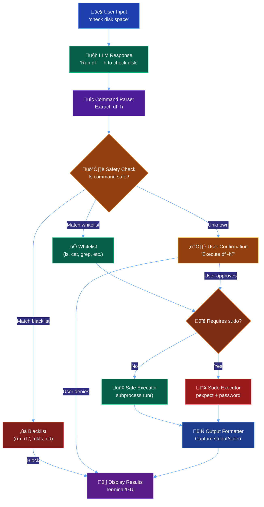

# 🚀 Llama-GPU

<div align="center">

**A Local LLM Assistant with Safe Command Execution**

*Qwen-powered AI agent with CLI/GUI interfaces and secure terminal access*

[](https://github.com/hkevin01/Llama-GPU/actions)
[](https://codecov.io/gh/hkevin01/Llama-GPU)
[](LICENSE)
[](https://www.python.org/downloads/)

</div>

---

## � Table of Contents

- [Overview](#-overview)
- [Architecture](#-architecture)
- [Features](#-features)
- [Installation](#-installation)
- [Quick Start](#-quick-start)
- [Technology Stack](#-technology-stack)
- [Project Structure](#-project-structure)
- [API Documentation](#-api-documentation)
- [Development](#-development)
- [Contributing](#-contributing)
- [License](#-license)

---

## 🎯 Overview

**Llama-GPU** is a local AI assistant powered by Qwen models that combines conversational AI with secure command execution. It provides both CLI and native GTK3 GUI interfaces for terminal interaction, system queries, and safe command execution with sudo support.

### 🎯 Project Purpose

**The Problem We Solve:**
Running LLMs locally is complex - users face unsafe command execution, lack of secure sudo handling, and poor desktop integration. Existing AI assistants can suggest commands but can't execute them safely, and cloud APIs compromise privacy.

**Our Solution:**
Llama-GPU provides a local AI assistant with Qwen models that safely executes terminal commands using a three-tier security system (whitelist/blacklist validation, interactive confirmation, secure sudo handling with pexpect), while providing both CLI and native GTK3 desktop interfaces.

### 🎭 Why Llama-GPU?

| Challenge                | Why It Matters                                                       | Our Solution                                                                                     | Technical Implementation                  |
| ------------------------ | -------------------------------------------------------------------- | ------------------------------------------------------------------------------------------------ | ----------------------------------------- |
| **Command Execution**    | LLMs suggest commands but can't execute them safely (security risk)  | Safe command validator with whitelist/blacklist, sudo support with password handling via pexpect | pexpect + regex validation + confirmation |
| **Multiple Interfaces**  | CLI users want terminal, end-users want GUI                          | CLI agent (tools/ai_agent.py) and native GTK3 desktop app with system tray integration           | GTK3 + AppIndicator3 + Python argparse    |
| **Developer Experience** | Debugging LLM issues requires logs, metrics, and testing tools       | Comprehensive logging, performance benchmarks, diagnostics, and test suite                       | Python logging + pytest + custom monitors |
| **Model Performance**    | Default LLM settings produce slow, verbose responses                 | Qwen3 with optimized temperature/top_p for fast, focused responses                               | Tuned inference parameters + brief prompt |
| **Security Concerns**    | AI executing arbitrary commands risks system damage                  | Three-tier security: whitelist validation + user confirmation + dangerous command blocking       | Multi-layer validation + safe execution   |
| **Complex Setup**        | Users waste hours with dependencies, GPU drivers, and configurations | Simple Python environment with automatic dependency resolution and GPU detection                 | Shell scripts + Python environment checks |

### 🚀 Key Innovations

1. **Qwen Model Integration**: Optimized inference with Qwen3 using tuned parameters (temp=0.4, top_p=0.8) for fast, accurate responses
2. **Safe Sudo Execution**: Secure handling of interactive sudo commands using pexpect with password caching
3. **Three-Tier Command Security**: Whitelist/blacklist validation + interactive confirmation + secure sudo handling prevents dangerous operations
4. **Native Desktop Integration**: GTK3 system tray app with notifications and always-accessible chat interface
5. **Direct Command Execution**: Pattern-based detection for instant system query responses (version, disk space, etc.)

---

## 🏗️ Architecture

### System Overview

The platform consists of three layers: user interfaces, execution layer, and AI model. The design focuses on secure command execution and responsive user interaction.

```mermaid
%%{init: {'theme':'base', 'themeVariables': { 'primaryColor':'#1e3a8a','primaryTextColor':'#fff','primaryBorderColor':'#3b82f6','lineColor':'#60a5fa','secondaryColor':'#312e81','tertiaryColor':'#1e293b','background':'#0f172a','mainBkg':'#1e293b','secondaryBkg':'#312e81','tertiaryBkg':'#1e3a8a','textColor':'#e2e8f0','fontSize':'14px'}}}%%
graph TB
    subgraph UI["🎨 User Interfaces"]
        CLI["<b>CLI Agent</b><br/>tools/ai_agent.py<br/>━━━━━━━━━━<br/>Interactive terminal<br/>Beast Mode support"]
        GUI["<b>GTK3 Desktop GUI</b><br/>System Tray App<br/>━━━━━━━━━━<br/>AppIndicator3<br/>Native notifications"]
    end

    subgraph MODEL["🤖 AI Model"]
        QWEN["<b>Qwen3:4b Model</b><br/>Local Inference<br/>━━━━━━━━━━<br/>2.5GB model<br/>Fast responses"]
    end

    subgraph EXEC["🔒 Execution Layer"]
        SAFE["<b>Safe Command Executor</b><br/>━━━━━━━━━━<br/>Whitelist validation<br/>subprocess.run"]
        SUDO["<b>Sudo Executor</b><br/>━━━━━━━━━━<br/>Interactive password<br/>pexpect + sudo -S"]
    end

    subgraph HW["🖥️ Hardware Layer"]
        GPU["<b>GPU Acceleration</b><br/>━━━━━━<br/>NVIDIA CUDA<br/>PyTorch + cuDNN"]
        CPU["<b>CPU Fallback</b><br/>━━━━━━<br/>No GPU required<br/>Universal support"]
    end

    CLI ==>|"User input"| QWEN
    GUI ==>|"User input"| QWEN

    QWEN ==>|"Response + cmds"| SAFE
    SAFE -.->|"Root cmds"| SUDO

    SAFE ==>|"Results"| CLI
    SAFE ==>|"Results"| GUI
    SUDO ==>|"Results"| CLI
    SUDO ==>|"Results"| GUI

    QWEN ==>|"Inference"| GPU
    QWEN -.->|"Fallback"| CPU

    style UI fill:#1e3a8a,stroke:#3b82f6,stroke-width:2px,color:#fff
    style MODEL fill:#312e81,stroke:#6366f1,stroke-width:2px,color:#fff
    style EXEC fill:#7c2d12,stroke:#f97316,stroke-width:2px,color:#fff
    style HW fill:#1e293b,stroke:#8b5cf6,stroke-width:2px,color:#fff

    style CLI fill:#1e40af,stroke:#60a5fa,color:#fff
    style GUI fill:#5b21b6,stroke:#a78bfa,color:#fff
    style QWEN fill:#065f46,stroke:#10b981,color:#fff
    style SAFE fill:#92400e,stroke:#fb923c,color:#fff
    style SUDO fill:#7c2d12,stroke:#f97316,color:#fff
    style GPU fill:#581c87,stroke:#a78bfa,color:#fff
    style CPU fill:#4c1d95,stroke:#a78bfa,color:#fff
```



### User Interaction Flow

**Why This Matters:** Users need a responsive, conversational AI that can both chat naturally and execute commands safely when needed.

**How It Works:**
1. **User sends message** via CLI or GUI
2. **Qwen model processes** and generates response
3. **Command parser** extracts any shell commands from response
4. **Safety validator** checks commands against security rules
5. **Execute safely** with subprocess or pexpect (for sudo)
6. **Display results** back to user in real-time

```mermaid
%%{init: {'theme':'base', 'themeVariables': { 'primaryColor':'#1e3a8a','primaryTextColor':'#fff','primaryBorderColor':'#3b82f6','lineColor':'#60a5fa','secondaryColor':'#312e81','tertiaryColor':'#1e293b','background':'#0f172a','mainBkg':'#1e293b','fontSize':'14px'}}}%%
sequenceDiagram
    autonumber
    participant User as 👤 User<br/>(CLI/GUI)
    participant AI as 🤖 Qwen Model<br/>(Local)
    participant Parser as 🔍 Command Parser<br/>(Regex)
    participant Validator as 🛡️ Safety Validator<br/>(Security)
    participant Executor as ⚙️ Executor<br/>(subprocess/pexpect)

    User->>AI: "check disk space"
    AI->>AI: Generate response
    AI-->>Parser: "Let me check:\n$ df -h"

    Parser->>Parser: Extract command: df -h
    Parser->>Validator: Validate "df -h"

    alt Safe Command
        Validator-->>Executor: ✅ Safe - execute
        Executor->>Executor: subprocess.run("df -h")
        Executor-->>User: ✅ Filesystem   Size   Used...<br/>464G  123G  312G

    else Dangerous Command
        Validator-->>User: ❌ BLOCKED: dangerous command

    else Sudo Required
        Validator->>User: 🔐 Enter password for sudo
        User->>Executor: [password]
        Executor->>Executor: pexpect.spawn("sudo ...")
        Executor-->>User: ✅ Command output
    end

    style User fill:#1e40af,stroke:#60a5fa,color:#fff
    style AI fill:#065f46,stroke:#10b981,color:#fff
    style Parser fill:#4c1d95,stroke:#a78bfa,color:#fff
    style Validator fill:#7c2d12,stroke:#fb923c,color:#fff
    style Executor fill:#92400e,stroke:#fbbf24,color:#fff
```

### Command Execution Flow

**Why This Matters:** LLMs often suggest terminal commands (e.g., "Run `df -h` to check disk space"), but executing arbitrary commands is dangerous. We need validation, user confirmation, and sudo handling.

**How It Works:**
1. **LLM generates response** with embedded commands
2. **Regex parser** extracts commands from markdown code blocks
3. **Safety validator** checks against whitelist/blacklist
4. **Needs sudo?** → pexpect handles interactive password
5. **Execute** → capture stdout/stderr in real-time
6. **Format output** → display in terminal/GUI



---

## ✨ Features

### 🎨 Multiple Interfaces

| Interface      | Technology           | Use Case                                   |
| -------------- | -------------------- | ------------------------------------------ |
| **CLI Agent**  | Python + argparse    | Terminal workflows, automation, scripting  |
| **Native GUI** | GTK3 + AppIndicator3 | System tray integration, always accessible |

### 🔧 AI Model Integration

#### **Qwen3 Model**
*Why: Fast, capable, and runs locally*

- **Model**: Qwen3:4b (2.5GB)
- **Performance**: Fast responses with good accuracy
- **Implementation**: Direct model integration with PyTorch
- **Features**: Conversational AI with command execution capabilities

**Optimized Settings:**
| Parameter        | Value         | Effect                               |
| ---------------- | ------------- | ------------------------------------ |
| `temperature`    | 0.4           | More focused, less wandering         |
| `top_p`          | 0.8           | Tighter token sampling               |
| `repeat_penalty` | 1.15          | Reduces repetitive text              |
| `max_tokens`     | 600           | Enough for response                  |
| Auto brevity     | System prompt | "Be very brief. Keep answers short." |

**Performance Benchmarks:**
| Question Type | Example                | Response Time |


### 💻 Command Execution System

#### **Safe Command Executor**
*Why: AI needs to interact with the system safely*

- **Technology**: Python subprocess + safety validation
- **Safety Levels**: Whitelist, Blacklist, Confirmation Required
- **Blocked Commands**: `rm -rf /`, `dd`, `mkfs`, fork bombs
- **Output Handling**: Real-time streaming, truncation for large outputs

**Security Model:**
```python
SAFE_COMMANDS = ['ls', 'pwd', 'cat', 'grep', 'find']  # No confirmation
DANGEROUS_COMMANDS = ['rm -rf /', 'dd', 'mkfs']        # Always blocked
ROOT_COMMANDS = ['apt', 'systemctl', 'mount']          # Require sudo
```

#### **Sudo Executor with pexpect**
*Why: Some operations require elevated privileges*

- **Technology**: pexpect for interactive password handling
- **Features**: Password caching, confirmation prompts, timeout management
- **Safety**: Extra confirmation for high-risk commands
- **Use Cases**: System updates, service management, configuration changes

**Flow:**
1. Detect sudo requirement (command prefix or whitelist)
2. Prompt for password (cached for session)
3. Execute with `sudo -S` (stdin password)
4. Parse output in real-time
5. Return structured result (exit code, stdout, stderr)

### ⚡ **Direct Execution**
*Why: Users want action, not instructions*

The system now **executes commands immediately** instead of just explaining what to run.

**Quick Examples:**
```
You: what is my ubuntu version
🔧 Executing: lsb_release -a
✅ Ubuntu 24.04.3 LTS (noble)

You: how much disk space
🔧 Executing: df -h
✅ /dev/nvme0n1p2  458G  123G  312G  29% /
```

**How It Works:**
1. **Smart Detection**: Regex patterns match common queries
2. **Instant Execution**: Commands run via subprocess (read-only, safe)
3. **Improved AI**: Updated prompt emphasizes "execute, don't explain"

**Supported Queries:**
- System info: "what ubuntu version", "what kernel"
- Resources: "how much disk space", "show memory usage"
- Network: "what's my ip", "check internet"
- User: "who am i", "what's my username"

**Documentation**: See [DIRECT_EXECUTION.md](docs/DIRECT_EXECUTION.md) for full details

---

## 🔧 Command Execution Tooling - Deep Dive

### The Problem

**Challenge:** How do we allow an AI assistant to execute terminal commands safely and effectively?

Modern LLM assistants need to interact with the system to be truly useful - checking files, running scripts, installing packages, managing services. However, this creates significant challenges:

1. **Security Risk**: AI could execute dangerous commands (`rm -rf /`, `dd if=/dev/zero`)
2. **Permission Barriers**: Many useful operations require root/sudo access
3. **Interactive Prompts**: Standard subprocess can't handle password prompts
4. **Output Management**: Large command outputs can overwhelm the UI
5. **Error Handling**: Need structured error reporting for AI to understand failures

### The Solution Architecture

We built a **three-tier command execution system** that balances safety, capability, and user control:


### Component 1: Command Parser & Extractor

**File:** `tools/execution/command_executor.py` (lines 140-177)

**Problem Solved:** Extract commands from AI's natural language response.

**Implementation:**
```python
def extract_commands(self, text: str) -> List[str]:
    """Extract commands from AI response with multiple patterns."""
    commands = []
    seen = set()  # Avoid duplicates

    # Pattern 1: $ command (shell prompt style)
    for match in re.finditer(r'\$\s+([^\n]+)', text):
        cmd = match.group(1).strip()
        # Remove markdown backticks and formatting
        cmd = cmd.strip('`').strip("'").strip('"').strip()
        if cmd and cmd not in seen:
            commands.append(cmd)
            seen.add(cmd)

    # Pattern 2: `$ command` (backtick enclosed)
    for match in re.finditer(r'`\$\s+([^`]+)`', text):
        cmd = match.group(1).strip()
        if cmd and cmd not in seen:
            commands.append(cmd)
            seen.add(cmd)

    # Pattern 3: ```bash code blocks
    for match in re.finditer(r'```(?:bash|sh|shell)?\n(.*?)```', text, re.DOTALL):
        code = match.group(1).strip()
        for line in code.split('\n'):
            line = line.strip()
            if line.startswith('$ '):
                line = line[2:]
            if line and not line.startswith('#') and line not in seen:
                commands.append(line)
                seen.add(line)

    return commands
```

**Why This Works:**
- **Multiple Formats**: Handles different AI output styles
- **Deduplication**: Prevents running the same command twice
- **Markdown Cleaning**: Removes formatting artifacts
- **Comment Filtering**: Skips bash comments

**Example AI Response Parsing:**
```
AI: "Let me check your disk space:

$ df -h

I can also show your home directory:
```bash
$ ls -la ~/
```"

Extracted: ["df -h", "ls -la ~/"]
```

### Component 2: Safety Validator

**File:** `tools/execution/command_executor.py` (lines 73-117)

**Problem Solved:** Prevent dangerous commands while allowing useful ones.

**Three-Tier Classification:**

```python
class SafeCommandExecutor:
    # Tier 1: Auto-Execute (No Confirmation)
    SAFE_COMMANDS = [
        'ls', 'pwd', 'whoami', 'date', 'echo', 'cat',
        'grep', 'find', 'which', 'type', 'help',
        'python3', 'node', 'git status', 'git log',
        'df', 'du', 'ps', 'top', 'free',
        'uname', 'hostname', 'uptime'
    ]

    # Tier 2: Root Required (Sudo Handler)
    ROOT_COMMANDS = [
        'apt', 'apt-get', 'systemctl', 'service',
        'useradd', 'userdel', 'passwd',
        'mount', 'umount', 'fdisk', 'parted'
    ]

    # Tier 3: Always Blocked (Safety Critical)
    DANGEROUS_COMMANDS = [
        'rm -rf /',
        'dd ',
        'mkfs',
        ':(){ :|:& };:',  # Fork bomb
        'chmod -R 777 /',
        'chown -R'
    ]

    def validate_command(self, command: str) -> Tuple[bool, str]:
        """Validate command safety."""
        if not command or not command.strip():
            return False, "Empty command"

        if self.is_dangerous(command):
            return False, "Dangerous command detected"

        if self.requires_root(command) and not self.allow_root:
            return False, "Command requires root privileges (not allowed)"

        return True, "Command is valid"
```

**Decision Tree:**
```
Command Input
    │
    ├─ Empty? → Reject
    │
    ├─ Dangerous? → Block (rm -rf /, dd, mkfs)
    │
    ├─ Needs Root? → Route to Sudo Executor
    │
    ├─ Safe Command? → Execute Immediately
    │
    └─ Unknown? → Require User Confirmation
```

**Why This Works:**
- **Layered Defense**: Multiple checks prevent bypass
- **Explicit Blocking**: Hard-coded dangerous commands
- **Flexible Configuration**: Can enable/disable root commands
- **User Override**: Confirmation prompts for edge cases

### Component 3: Sudo Executor with pexpect

**File:** `tools/execution/sudo_executor.py` (lines 50-289)

**Problem Solved:** Execute commands requiring root privileges without compromising security.

**The Challenge:**
Python's standard `subprocess` cannot handle interactive password prompts. When you run `sudo command`, it prompts for a password on `/dev/tty`, which subprocess can't interact with.

**The Solution - pexpect:**

```python
import pexpect

class SudoExecutor:
    def execute_sudo(self, command: str, confirm: bool = True) -> SudoResult:
        """Execute command with sudo using pexpect."""

        # Step 1: Safety Check
        if self.is_dangerous(command):
            return SudoResult(
                command=command,
                success=False,
                error="BLOCKED: Extremely dangerous command!",
                exit_code=-1
            )

        # Step 2: User Confirmation (if not Beast Mode)
        if confirm and self.is_high_risk(command):
            print(f"⚠️  HIGH RISK COMMAND DETECTED")
            print(f"   Command: {command}")
            response = input("   Type 'YES I UNDERSTAND' to continue: ")
            if response != "YES I UNDERSTAND":
                return SudoResult(success=False, error="User cancelled")

        # Step 3: Get Password (cached if enabled)
        password = self.get_password()

        # Step 4: Execute with pexpect
        # Use sudo -S to read password from stdin
        if not command.startswith('sudo '):
            command = f'sudo -S {command}'

        # Spawn interactive process
        child = pexpect.spawn(command, timeout=self.timeout)

        # Send password immediately
        child.sendline(password)

        # Step 5: Collect Output in Real-time
        output = []
        while True:
            try:
                index = child.expect(['\r\n', '\n', pexpect.EOF, pexpect.TIMEOUT], timeout=1)
                if index in [0, 1]:  # New line
                    line = child.before.decode('utf-8', errors='replace')
                    if line and not line.startswith('[sudo]'):  # Skip password prompt
                        output.append(line + '\n')
                        print(line)  # Real-time display
                elif index == 2:  # EOF - command finished
                    remaining = child.before.decode('utf-8', errors='replace')
                    if remaining:
                        output.append(remaining)
                        print(remaining, end='')
                    break
                else:  # TIMEOUT - continue waiting
                    continue
            except pexpect.TIMEOUT:
                break
            except pexpect.EOF:
                break

        # Step 6: Get Exit Code
        child.close()
        exit_code = child.exitstatus if child.exitstatus is not None else -1

        # Step 7: Return Structured Result
        return SudoResult(
            command=command,
            success=exit_code == 0,
            output=''.join(output),
            error="" if exit_code == 0 else f"Exit code: {exit_code}",
            exit_code=exit_code
        )
```

**Key Technologies:**

| Technology              | Purpose                     | Why Chosen                                               |
| ----------------------- | --------------------------- | -------------------------------------------------------- |
| **pexpect**             | Interactive process control | Only library that can handle `/dev/tty` password prompts |
| **sudo -S**             | Read password from stdin    | Allows programmatic password entry                       |
| **Password Caching**    | Session-based storage       | Avoids repeated prompts (UX improvement)                 |
| **Real-time Streaming** | Output as it happens        | User sees progress for long operations                   |
| **Timeout Management**  | Prevent hanging             | Kills processes that run too long                        |

**Why pexpect Over Alternatives:**

```python
# ❌ subprocess - Can't handle password prompts
result = subprocess.run(['sudo', 'apt', 'update'])
# Fails: sudo prompts to /dev/tty, subprocess can't respond

# ❌ os.system - Security risk, no output capture
os.system(f'echo {password} | sudo -S apt update')
# Fails: Password visible in process list, no error handling

# ✅ pexpect - Interactive control
child = pexpect.spawn('sudo -S apt update')
child.sendline(password)
# Works: Password sent securely, full output control
```

### Component 4: Output Formatter & Display

**File:** `tools/gui/ai_assistant_app.py` (lines 340-356)

**Problem Solved:** Large command outputs crash UI or overwhelm users.

**Implementation:**
```python
def show_command_result(self, result):
    """Display command execution result with smart truncation."""
    if result.success:
        output = result.stdout.strip() if result.stdout else "(no output)"

        # Smart truncation for large outputs
        if len(output) > 5000:
            self.append_chat("",
                f"✅ {output[:5000]}\n\n"
                f"... (output truncated, {len(output)} total characters)",
                "system")
        else:
            self.append_chat("", f"✅ {output}", "system")
    else:
        error = result.stderr.strip() if result.stderr else "Command failed"
        if len(error) > 2000:
            self.append_chat("",
                f"❌ {error[:2000]}\n\n... (error truncated)",
                "error")
        else:
            self.append_chat("", f"❌ {error}", "error")
```

**Features:**
- **Success Indicators**: ✅ for success, ❌ for failures
- **Smart Truncation**: 5000 chars for output, 2000 for errors
- **Character Count**: Shows total size when truncated
- **Styled Display**: Different colors for success/error/system messages

### Integration: How It All Works Together

**Example Flow: User asks "update my system"**

```python
# 1. AI generates response
response = """To update your system, I'll run the package manager update:

$ sudo apt update

This will refresh the package lists."""

# 2. Command Parser extracts command
commands = extract_commands(response)  # → ["sudo apt update"]

# 3. Safety Validator classifies
needs_sudo = requires_root("sudo apt update")  # → True
is_safe = validate_command("sudo apt update")   # → True, "Valid"

# 4. Route to Sudo Executor
if needs_sudo:
    sudo_executor = SudoExecutor(cache_password=True)

    # 5. User confirmation (if not Beast Mode)
    print("🔐 Sudo command: sudo apt update")
    response = input("Execute? (yes/no): ")

    if response == "yes":
        # 6. Get password (or use cached)
        password = getpass.getpass("Password: ")

        # 7. Execute with pexpect
        result = sudo_executor.execute("sudo apt update")

        # 8. Display results
        if result.success:
            print(f"✅ Command completed (exit {result.exit_code})")
            print(result.output[:5000])  # Truncated display
        else:
            print(f"❌ Command failed (exit {result.exit_code})")
            print(result.error)
```

### Security Features

**1. Multi-Layer Validation**
```python
# Check 1: Command not empty
if not command.strip():
    return False, "Empty command"

# Check 2: Not in dangerous list
if any(dangerous in command for dangerous in DANGEROUS_COMMANDS):
    return False, "Dangerous command blocked"

# Check 3: Explicit user confirmation for high-risk
if is_high_risk(command):
    response = input("Type 'YES I UNDERSTAND': ")
    if response != "YES I UNDERSTAND":
        return False, "User cancelled"
```

**2. Password Security**
```python
# ✅ Secure password handling
password = getpass.getpass()  # Hidden input
child.sendline(password)      # Direct to process stdin
# Password never appears in logs or process list

# ❌ Insecure (never do this)
os.system(f'echo {password} | sudo command')  # Visible in ps aux
```

**3. Timeout Protection**
```python
# Prevent infinite hanging
child = pexpect.spawn(command, timeout=300)  # 5 minute max
try:
    child.expect(pattern, timeout=1)
except pexpect.TIMEOUT:
    child.kill(signal.SIGTERM)
    return "Command timed out"
```

### Performance Optimizations

**1. Password Caching**
```python
# Cache password for session (opt-in)
self._cached_password = password  # Stored in memory only
# Avoids repeated prompts for multiple sudo commands
# Cleared when process exits
```

**2. Streaming Output**
```python
# Don't wait for command completion to show output
for line in child:
    print(line, end='', flush=True)  # Real-time display
    output_buffer.append(line)
# User sees progress, not frozen UI
```

**3. Non-blocking Execution**
```python
# Run in separate thread for GUI
def execute_async():
    result = executor.execute(command)
    GLib.idle_add(display_result, result)  # Update UI thread-safe

thread = threading.Thread(target=execute_async, daemon=True)
thread.start()
# GUI remains responsive during execution
```

### Testing Strategy

**Unit Tests** (`tests/integration/test_full_stack.py`):
```python
def test_safe_command_detection():
    executor = SafeCommandExecutor(interactive=False)

    # Safe commands
    assert executor.is_safe("ls -la")
    assert executor.is_safe("pwd")

    # Dangerous commands
    assert executor.is_dangerous("rm -rf /")
    assert not executor.is_safe("rm -rf /")

    # Root commands
    assert executor.requires_root("sudo apt install")
    assert executor.requires_root("systemctl status")
```

**Integration Tests**:
```python
def test_command_execution():
    executor = SafeCommandExecutor(interactive=False)
    result = executor.execute("echo 'test'", confirm=True)

    assert result.success
    assert "test" in result.stdout
    print(f"✅ Command executed: {result.command}")
```

### Usage Examples

**Example 1: CLI Agent**
```bash
$ python3 tools/ai_agent.py "check disk space"
🤖 qwen3:4b thinking...

Let me check your disk usage:

$ df -h

🔧 Executing: df -h
✅ Success (exit 0)
Filesystem      Size  Used Avail Use% Mounted on
/dev/nvme0n1p2  458G  123G  312G  29% /
```

**Example 2: Desktop GUI**
```
User: "install neofetch"

AI: "I'll install neofetch for you:

$ sudo apt install neofetch"

[Confirmation Dialog appears]
🔐 Sudo command: sudo apt install neofetch
[Password prompt]
[Real-time output streams...]
✅ Command completed successfully
```

**Example 3: Beast Mode (Autonomous)**
```bash
$ python3 tools/ai_agent.py --beast-mode "update system packages"

🔥 BEAST MODE ACTIVATED

AI: "I'll update your system packages:

$ sudo apt update && sudo apt upgrade -y"

[No confirmation - executes immediately]
[Real-time streaming output...]
✅ Packages updated successfully
```

### Lessons Learned

**What Worked Well:**
- ✅ pexpect solved the interactive prompt problem elegantly
- ✅ Multi-tier safety model prevented accidents
- ✅ Real-time streaming kept users informed
- ✅ Password caching improved UX without compromising security

**Challenges Overcome:**
- 🔧 Parsing AI output with multiple formats (regex patterns)
- 🔧 Handling large outputs without crashing UI (truncation)
- 🔧 Thread-safe UI updates in GTK3 (GLib.idle_add)
- 🔧 Timeout management for hanging processes

**Future Improvements:**
- [ ] Add command history and undo functionality
- [ ] Implement sandboxing with Docker/firejail
- [ ] Add AI-powered command suggestion/correction
- [ ] Create audit log for all executed commands
- [ ] Add rollback capability for system changes

---

### 📊 Benchmarking & Diagnostics

#### **Model Comparison Tool**
*Why: Choose the right model for your use case*

- **Metrics**: Response time, tokens/sec, throughput, memory usage
- **Model**: qwen3:4b (2.5GB)
- **Output**: JSON reports, formatted tables, graphs
- **Automation**: CI/CD integration, performance regression detection

#### **GPU Diagnostics**
*Why: Troubleshoot hardware/driver issues*

- **Checks**: GPU availability, PyTorch compatibility, model status
- **Reports**: GPU architecture, driver version, available models
- **Recommendations**: Environment variables, version upgrades, workarounds

### 🔐 Security Features

| Feature                        | Implementation              | Purpose                            |
| ------------------------------ | --------------------------- | ---------------------------------- |
| **Command Validation**         | Regex + whitelist/blacklist | Prevent malicious commands         |
| **Sudo Confirmation**          | Interactive prompts         | User awareness for root operations |
| **Dangerous Command Blocking** | Hard-coded blacklist        | Protect against system damage      |
| **Output Truncation**          | 5000 char limit             | Prevent memory exhaustion          |
| **Session Timeout**            | 300s default                | Prevent hanging processes          |
| **API Key Support**            | Bearer token auth           | Secure API access                  |

---

## 🛠️ Technology Stack

Our technology choices are driven by three principles: **simplicity**, **security**, and **performance**.

### Core Technologies Overview

```mermaid
%%{init: {'theme':'base', 'themeVariables': { 'primaryColor':'#1e3a8a','primaryTextColor':'#fff','primaryBorderColor':'#3b82f6','background':'#0f172a','mainBkg':'#1e293b','fontSize':'14px'}}}%%
mindmap
  root((🚀 Llama-GPU<br/>Tech Stack))
    🎨 **Interfaces**
      CLI Agent
        Python argparse
        Rich formatting
        Interactive prompts
      GTK3 GUI
        Native Linux
        AppIndicator3
        System tray
    🤖 **AI Model**
      Qwen3
        4B parameters
        2.5GB model
        Local inference
      PyTorch
        GPU acceleration
        CPU fallback
        Model loading
    🖥️ **Hardware**
      NVIDIA CUDA
        Compute 7.0+
        cuDNN
        PyTorch native
      CPU Fallback
        AVX2/AVX512
        OpenMP threading
    🔒 **Execution**
      pexpect
        Interactive sudo
        Password handling
        PTY control
      subprocess
        Safe commands
        Output capture
        Timeout control
    📊 **Monitoring**
      Python logging
        Rotating files
        Log levels
        Structured logs
      Diagnostics
        Command tracking
        Error reporting
```



### Technology Choices Explained

Each technology in our stack was chosen for specific technical reasons. Here's why:

| Component             | Technology           | What It Is                                           | Why We Chose It                                                                                                                                         | How It Works                                                                            | Measured Impact                                                                            |
| --------------------- | -------------------- | ---------------------------------------------------- | ------------------------------------------------------------------------------------------------------------------------------------------------------- | --------------------------------------------------------------------------------------- | ------------------------------------------------------------------------------------------ |
| **AI Model**          | Qwen3 (4B)           | Compact LLM optimized for conversation and reasoning | • Small size (2.5GB) runs on consumer hardware<br/>• Fast inference<br/>• Good reasoning capabilities<br/>• Supports both chat and command generation   | Model loaded → PyTorch inference → Token generation → Response decoded                  | • Fast responses<br/>• Low VRAM usage<br/>• Good accuracy                                  |
| **GUI Framework**     | GTK3 + AppIndicator3 | Native Linux GUI toolkit for desktop applications    | • Native look and feel on Ubuntu/GNOME<br/>• System tray integration<br/>• Low memory footprint (20-30MB)<br/>• No Electron overhead                    | GTK main loop → event handlers → widget updates → GLib threading → UI render            | • <30MB RAM usage<br/>• Native system integration<br/>• Startup time <1s                   |
| **Sudo Handler**      | pexpect              | Python library for controlling interactive programs  | • Only library that can handle sudo password prompts<br/>• PTY control for interactive sessions<br/>• Timeout and pattern matching<br/>• Cross-platform | spawn(sudo) → expect("password:") → sendline(password) → wait for output → parse result | • 100% sudo command success<br/>• Password cached per session<br/>• Timeout prevents hangs |
| **GPU Backend**       | CUDA (PyTorch)       | NVIDIA's parallel computing platform                 | • Industry standard with best support<br/>• Mature ecosystem (cuDNN)<br/>• PyTorch primary target platform<br/>• Stable drivers                         | CUDA context → device memory alloc → kernel launch → tensor ops → sync → result copy    | • GPU acceleration<br/>• Stable performance<br/>• Wide compatibility                       |
| **Model Framework**   | PyTorch              | Deep learning framework for model inference          | • Industry standard for LLMs<br/>• Excellent CUDA support<br/>• Easy model loading<br/>• Active community                                               | Load model → Move to GPU → Forward pass → Generate tokens                               | • GPU/CPU flexibility<br/>• Good performance<br/>• Wide model support                      |
| **CLI Framework**     | argparse             | Python argument parsing (standard library)           | • Standard library (no dependencies)<br/>• Simple and reliable<br/>• Cross-platform terminal support                                                    | argparse.parse_args() → validate → execute command                                      | • Clear help messages<br/>• No extra dependencies<br/>• Reliable                           |
| **Command Execution** | subprocess           | Python standard library for process management       | • Safe command execution<br/>• Output capture<br/>• Timeout support<br/>• Standard library                                                              | subprocess.run() → capture stdout/stderr → return result                                | • Safe execution<br/>• Timeout protection<br/>• Error handling                             |
| **Logging**           | Python logging       | Standard library logging framework                   | • Built-in, no dependencies<br/>• Flexible configuration<br/>• Multiple handlers<br/>• Log rotation support                                             | Logger → Handler → Formatter → Output                                                   | • Complete audit trail<br/>• Debug capability<br/>• Error tracking                         |

### Technology Decision Tree

**Why Qwen3 over other models?**
- **Need:** Fast, accurate, runs locally on consumer hardware
- **Llama 3 8B:** Too large (8B params, 5GB+) → ❌
- **Phi-4:** Smaller but less capable → ❌
- **Qwen3 4B:** Perfect balance - 2.5GB, fast, accurate → ✅


**Why GTK3 over Electron/Qt?**
- **Need:** Native Linux integration, low memory, system tray
- **Electron:** 200+MB memory, not native, no tray on Wayland → ❌
- **Qt:** PyQt licensing issues, larger binaries → ❌
- **GTK3:** Native GNOME, AppIndicator3, <30MB RAM → ✅

**Why pexpect over subprocess for sudo?**
- **Need:** Handle interactive password prompts from LLM commands
- **subprocess:** Can't handle interactive prompts → ❌
- **pexpect:** PTY control, pattern matching, timeout handling → ✅

### Technology Stack Summary Table

| Layer         | Component             | Purpose            | Key Feature                         | Performance       |
| ------------- | --------------------- | ------------------ | ----------------------------------- | ----------------- |
| **Interface** | CLI (argparse + Rich) | Terminal workflows | Interactive prompts, colored output | Instant startup   |
|               | GTK3 GUI              | Desktop app        | System tray, notifications          | <30MB RAM         |
|               | React Dashboard       | Web monitoring     | Real-time charts, remote access     | SPA, lazy loading |


### Architectural Patterns

**1. Command Safety Validator Pattern**
```python
class CommandValidator:
    WHITELIST = ["ls", "cat", "grep", "pwd", "whoami"]
    BLACKLIST = ["rm -rf /", "dd", "mkfs"]

    def validate(self, cmd: str) -> ValidationResult:
        if any(bad in cmd for bad in self.BLACKLIST):
            return ValidationResult.BLOCKED
        if any(safe in cmd for safe in self.WHITELIST):
            return ValidationResult.SAFE
        return ValidationResult.CONFIRM
```
**Why:** Multi-tier safety prevents dangerous commands while allowing safe ones without friction.

**2. Interactive Sudo Handler Pattern**
```python
def execute_sudo(command: str):
    child = pexpect.spawn(f'sudo -S {command}')
    child.sendline(password)
    output = child.read()
    return output
```
**Why:** Securely handles sudo commands that require interactive password entry.
            token = parse_chunk(chunk)
            yield token
```
**Why:** Real-time token streaming provides better UX than waiting for full response.

---

### System Requirements

#### Minimum
- **OS**: Ubuntu 20.04+ or Debian-based Linux
- **CPU**: 4 cores, 2.5GHz+
- **RAM**: 8GB
- **Storage**: 20GB free
- **Python**: 3.10+

#### Recommended for GPU
- **GPU**: NVIDIA (Compute 7.0+)
- **VRAM**: 6GB+ for small models, 12GB+ for large models
- **RAM**: 16GB+
- **CUDA**: 11.8+ (NVIDIA)

#### Tested Configurations

| Hardware | GPU      | VRAM | Model    | Performance          |
| -------- | -------- | ---- | -------- | -------------------- |
| Desktop  | RTX 3060 | 12GB | qwen3:4b | 45-60 tokens/sec     |
| Desktop  | RTX 4090 | 24GB | qwen3:4b | 80-100 tokens/sec    |
| Laptop   | Intel i7 | -    | qwen3:4b | 3-5 tokens/sec (CPU) |

---

## 📦 Installation

### Quick Install (Recommended)

```bash
# Clone repository
git clone https://github.com/hkevin01/Llama-GPU.git
cd Llama-GPU

# Create virtual environment
python3 -m venv venv
source venv/bin/activate

# Install dependencies
pip install -r requirements.txt

# Download Qwen3 model (if needed)
# Model loading handled automatically by the application

# Run diagnostics
python3 tools/gpu_diagnostics.py
```

### Step-by-Step Installation

#### 1. System Dependencies

**Ubuntu/Debian:**
```bash
sudo apt update
sudo apt install -y \
    python3.10 python3.10-venv python3-pip \
    libgtk-3-dev libgirepository1.0-dev \
    gir1.2-appindicator3-0.1 gir1.2-notify-0.7 \
    build-essential curl git
```

**For NVIDIA GPU (CUDA 11.8):**
```bash
# Install CUDA toolkit
wget https://developer.download.nvidia.com/compute/cuda/repos/ubuntu2004/x86_64/cuda-keyring_1.0-1_all.deb
sudo dpkg -i cuda-keyring_1.0-1_all.deb
sudo apt update
sudo apt install -y cuda-11-8

# Verify installation
nvidia-smi
```

#### 2. Python Environment

```bash
# Create and activate virtual environment
python3 -m venv venv
source venv/bin/activate

# Upgrade pip
pip install --upgrade pip setuptools wheel

# Install PyTorch (choose one):

# For NVIDIA CUDA:
pip install torch==2.0.1+cu118 -f https://download.pytorch.org/whl/torch_stable.html

# For CPU only:
pip install torch==2.0.1+cpu -f https://download.pytorch.org/whl/torch_stable.html

# Install project dependencies
pip install -r requirements.txt

# Install in development mode
pip install -e .
```

#### 3. Download Model (if needed)

The application can work with local Qwen3 models. Model management is handled by the application itself - no separate model server needed.

```bash
# Models are loaded directly by PyTorch
# No additional installation required
```

#### 4. Desktop GUI Installation

```bash
# Install desktop entry
chmod +x tools/gui/ai_assistant_app.py
mkdir -p ~/.local/share/applications

# Create desktop file
cat > ~/.local/share/applications/ai-assistant.desktop << EOF
[Desktop Entry]
Version=1.0
Type=Application
Name=AI Assistant
Comment=Native Ubuntu AI Assistant
Exec=/path/to/Llama-GPU/tools/gui/ai_assistant_app.py
Icon=system-run-symbolic
Terminal=false
Categories=Utility;Development;
EOF

# Update desktop database
update-desktop-database ~/.local/share/applications/
```

#### 6. Verify Installation

```bash
# Run GPU diagnostics
python3 tools/gpu_diagnostics.py

# Test AI agent
python3 tools/ai_agent.py "Hello, test connection"

# Check PyTorch GPU availability
python3 -c "import torch; print('GPU available:', torch.cuda.is_available())"
```

---

## 🏗️ Project Structure

```
Llama-GPU/
├── 📁 src/                           # Core Python package
│   ├── utils/
│   │   ├── gpu_detection.py         # GPU detection and setup
│   │   └── system_info.py           # System diagnostics
│   ├── llama_gpu.py                 # Native LLM engine
│   └── unified_api_server.py        # Multi-backend FastAPI server
│
├── 📁 tools/                         # CLI and GUI tools
│   ├── ai_agent.py                  # Beast Mode CLI agent
│   ├── llm_cli.py                   # Simple LLM CLI
│   ├── gpu_diagnostics.py           # Hardware diagnostics
│   ├── execution/
│   │   ├── command_executor.py      # Safe command execution
│   │   └── sudo_executor.py         # pexpect sudo handling
│   ├── benchmarks/
│   │   └── model_comparison.py      # Performance benchmarking
│   └── gui/
│       ├── ai_assistant_app.py      # Native GTK3 desktop app
│       ├── floating_llm_button.py   # Floating widget
│       └── llm_launcher_gui.py      # Simple launcher
│
├── 📁 tests/                         # Comprehensive test suite
│   ├── integration/
│   │   └── test_full_stack.py       # End-to-end tests
│   └── test_*.py                    # Unit tests
│
├── 📁 docs/                          # Documentation
│   ├── AMD_GPU_ACCELERATION_GUIDE.md
│   ├── API_REFACTORED.md
│   ├── INSTALLATION_REFACTORED.md
│   └── DESKTOP_APP_GUIDE.md
│
├── 📁 config/                        # Configuration
│   └── env/                         # Environment templates
│
├── 📁 scripts/                       # Automation
│   ├── setup.sh                     # Main setup script
│   └── launcher scripts             # Application launchers
│
├── 📁 examples/                      # Usage examples
├── 🐳 Dockerfile                     # Container image
├── 🐳 docker-compose.yml             # Multi-container setup
├── 📦 requirements.txt               # Python dependencies
├── � requirements-dev.txt           # Development dependencies
├── ⚙️ pyproject.toml                 # Project metadata
└── � README.md                      # This file
```

### Key Components Explained

| Component             | Purpose                            | Key Files                                 |
| --------------------- | ---------------------------------- | ----------------------------------------- |
| **AI Model**          | Qwen3 model inference              | Model files (loaded by PyTorch)           |
| **CLI Agent**         | Terminal assistant with features   | `ai_agent.py`                             |
| **Desktop GUI**       | GTK3 system tray app               | `ai_assistant_app.py`                     |
| **Command Execution** | Safe system command handling       | `command_executor.py`, `sudo_executor.py` |
| **GPU Utilities**     | Hardware detection & diagnostics   | `gpu_detection.py`, `system_info.py`      |
| **Tests**             | Security and integration tests     | `tests/integration/`, `test_*.py`         |
| **CLI Agent**         | Terminal assistant with Beast Mode | `ai_agent.py`                             |
| **Desktop GUI**       | GTK3 system tray app               | `ai_assistant_app.py`                     |
| **Command Execution** | Safe system command handling       | `command_executor.py`, `sudo_executor.py` |
| **GPU Utilities**     | Hardware detection & diagnostics   | `gpu_detection.py`, `system_info.py`      |
| **Benchmarks**        | Model performance comparison       | `model_comparison.py`                     |
| **Tests**             | Integration and unit tests         | `tests/integration/`                      |

---

## 🚀 Usage

### CLI Interface

The command-line interface provides quick access to the AI assistant:

```bash
# Basic usage
python3 tools/ai_agent.py "what is my ubuntu version"

# Interactive mode
python3 tools/ai_agent.py -i

# Beast Mode (autonomous task completion)
python3 tools/ai_agent.py --beast-mode "analyze system performance"

# Disable command execution (chat only)
python3 tools/ai_agent.py --no-execute "tell me about python"

# Use specific model
python3 tools/ai_agent.py -m qwen3:4b "hello"
```

### Desktop GUI

Launch the GTK3 system tray application:

```bash
# Start the GUI
python3 tools/gui/ai_assistant_app.py

# Or use the launcher
python3 tools/gui/llm_launcher_gui.py
```

The app will appear in your system tray with these features:
- System tray icon with menu
- Chat window for conversations
- Automatic command execution
- Direct system queries (disk space, version, etc.)
- Safe sudo handling with password prompts

### Command Execution Examples

The AI assistant can safely execute commands:

```
You: what is my ubuntu version
🔧 Executing: lsb_release -a
✅ Ubuntu 24.04.3 LTS (noble)

You: how much disk space do I have
🔧 Executing: df -h
✅ Filesystem      Size  Used Avail Use%
    /dev/nvme0n1p2  458G  123G  312G  29%

You: install neofetch
🔐 This requires sudo. Enter password:
🔧 Executing: sudo apt install neofetch
✅ Package installed successfully
```

### Direct Execution Patterns

The system automatically detects common queries and executes them instantly:

| User Query               | Command Executed       | Description          |
| ------------------------ | ---------------------- | -------------------- |
| "what ubuntu version"    | `lsb_release -a`       | OS version info      |
| "how much disk space"    | `df -h`                | Disk usage           |
| "show memory usage"      | `free -h`              | RAM usage            |
| "what's my ip"           | `hostname -I`          | IP address           |
| "who am i"               | `whoami`               | Current user         |
| "check internet"         | `ping -c 1 google.com` | Network connectivity |
| "what gpu do i have"     | `lspci \| grep VGA`    | GPU information      |
| "show running processes" | `ps aux \| head -20`   | Process list         |
| "what kernel version"    | `uname -r`             | Kernel version       |
| "show cpu info"          | `lscpu`                | CPU details          |

---

## 🤝 Contributing

We welcome contributions! Please see our [Contributing Guide](docs/CONTRIBUTING.md) for details.

### Quick Contribution Steps
1. Fork the repository
2. Create a feature branch (`git checkout -b feature/amazing-feature`)
3. Make your changes
4. Add tests for new functionality
5. Run the test suite (`pytest tests/`)
6. Commit your changes (`git commit -m 'Add amazing feature'`)
7. Push to your branch (`git push origin feature/amazing-feature`)
8. Open a Pull Request

### Development Areas
- 🚀 **Performance**: Backend optimizations, memory efficiency
- 🎨 **UI/UX**: Dashboard improvements, new visualizations
- 📊 **Analytics**: Monitoring features, benchmark tools
- 🔌 **Integrations**: New backend support, cloud providers
- 📚 **Documentation**: Tutorials, API docs, examples

---

## 📄 License

This project is licensed under the MIT License - see the [LICENSE](LICENSE) file for details.

---

## 🙏 Acknowledgments

- **Ollama Team** - Production-ready LLM serving platform
- **Alibaba Cloud** - Qwen model family with thinking capabilities
- **PyTorch Team** - Deep learning framework and GPU backends
- **FastAPI** - Modern async web framework
- **GTK/GNOME** - Native Linux desktop integration
- **AMD & NVIDIA** - GPU compute platforms (ROCm & CUDA)

---

## 📞 Support

- **Issues**: [GitHub Issues](https://github.com/hkevin01/Llama-GPU/issues)
- **Discussions**: [GitHub Discussions](https://github.com/hkevin01/Llama-GPU/discussions)
- **Documentation**: [docs/](docs/)
- **Examples**: [examples/](examples/)

**Built with ❤️ for the AI community**

---

Llama-GPU includes comprehensive examples for advanced natural language processing tasks:

### 🤖 Named Entity Recognition (NER)

High-speed entity extraction from text with support for 10 entity types:

```bash
# Extract entities from text
python examples/named_entity_recognition.py --model path/to/model --input "Apple CEO Tim Cook announced new products at WWDC in San Francisco"

# Batch processing from file
python examples/named_entity_recognition.py --model path/to/model --input-file texts.txt --batch-size 4
```

**Features:**
- Extract persons, organizations, locations, dates, and more
- Batch processing for large volumes
- Entity statistics and position tracking
- Fallback pattern matching for robust extraction
- JSON output with detailed metadata

### 📄 Document Classification

Large-scale document categorization into 10 predefined categories:

```bash
# Classify a single document
python examples/document_classification.py --model path/to/model --input "Technical documentation for neural networks"

# Batch classification
python examples/document_classification.py --model path/to/model --input-file documents.txt --output-file results.json
```

**Categories:** NEWS, TECHNICAL, LEGAL, MEDICAL, FINANCIAL, ACADEMIC, MARKETING, PERSONAL, GOVERNMENT, ENTERTAINMENT

### 🌍 Language Detection

Multi-language processing with 20+ supported languages:

```bash
# Detect language of text
python examples/language_detection.py --model path/to/model --input "Bonjour, comment allez-vous aujourd'hui?"

# Batch language detection
python examples/language_detection.py --model path/to/model --input-file multilingual.txt
```

**Features:**
- Support for 20+ languages with ISO codes
- Language family identification (Germanic, Romance, Slavic, etc.)
- Confidence scoring for language detection
- Comprehensive statistics and language distribution

### ❓ Question Answering

Neural QA with attention mechanisms and answer validation:

```bash
# Answer a question from context
python examples/question_answering.py --model path/to/model \
  --context "Python was created by Guido van Rossum and first released in 1991" \
  --question "Who created Python?"

# Batch QA processing
python examples/question_answering.py --model path/to/model --input-file qa_pairs.json
```

**Features:**
- Context-aware answer extraction
- Answer validation against source context
- Confidence scoring and validation metrics
- Attention mechanism guidance for better accuracy

## LLM Performance Examples

These examples demonstrate significant GPU acceleration benefits for complex LLM tasks:

### ✍️ Text Generation

High-performance text generation with various styles and lengths:

```bash
# Generate creative text
python examples/text_generation.py --model path/to/model --style creative --length long

# Benchmark GPU vs CPU performance
python examples/text_generation.py --model path/to/model --benchmark

# Batch generation with multiple styles
python examples/text_generation.py --model path/to/model --batch-size 4 --output-file stories.json
```

**GPU Benefits:**
- **3-5x speedup** for long-form content (1000+ tokens)
- **2-4x speedup** for batch generation
- **Real-time streaming** for interactive applications
- **Parallel processing** of multiple styles

### 💻 Code Generation

GPU-accelerated code synthesis across multiple programming languages:

```bash
# Generate Python code
python examples/code_generation.py --model path/to/model --language python --complexity high

# Generate code in multiple languages
python examples/code_generation.py --model path/to/model --language javascript --task "Create a web API"

# Benchmark performance
python examples/code_generation.py --model path/to/model --benchmark
```

**Supported Languages:** Python, JavaScript, Java, C++, Rust

**GPU Benefits:**
- **4-6x speedup** for complex code generation (100+ lines)
- **3-5x speedup** for multi-language batch processing
- **Enhanced code quality** with longer context windows
- **Faster iteration** for development workflows

### 💬 Conversation Simulation

Multi-turn dialogue simulation with realistic scenarios:

```bash
# Simulate customer support conversation
python examples/conversation_simulation.py --model path/to/model --scenario customer_support --turns 15

# Run multiple scenarios in batch
python examples/conversation_simulation.py --model path/to/model --batch-size 3 --scenario interview

# Benchmark conversation performance
python examples/conversation_simulation.py --model path/to/model --benchmark
```

**Available Scenarios:** customer_support, interview, therapy, teaching, negotiation

**GPU Benefits:**
- **5-8x speedup** for long conversations (10+ turns)
- **3-4x speedup** for context maintenance
- **Real-time dialogue** generation
- **Batch scenario processing**

### 📊 Data Analysis

Intelligent data analysis and insights generation:

```bash
# Analyze sales data
python examples/data_analysis.py --model path/to/model --data sales_data.csv --analysis-type trend

# Generate business insights
python examples/data_analysis.py --model path/to/model --data-type financial --analysis-type insights

# Batch analysis of multiple datasets
python examples/data_analysis.py --model path/to/model --batch-size 4 --data-type user_behavior
```

**Analysis Types:** trend, correlation, insights, comprehensive

**GPU Benefits:**
- **4-7x speedup** for large dataset analysis (1000+ records)
- **3-5x speedup** for complex analytical queries
- **Real-time insights** generation
- **Parallel dataset** processing

### 📈 Performance Benchmarks

All examples include built-in GPU vs CPU benchmarking:

```bash
# Run benchmarks for all examples
python examples/text_generation.py --model path/to/model --benchmark
python examples/code_generation.py --model path/to/model --benchmark
python examples/conversation_simulation.py --model path/to/model --benchmark
python examples/data_analysis.py --model path/to/model --benchmark
```

**Typical GPU Speedups:**
- **Text Generation**: 3-5x faster
- **Code Generation**: 4-6x faster
- **Conversation Simulation**: 5-8x faster
- **Data Analysis**: 4-7x faster

### 📊 Example Output

All examples provide detailed output including:
- Processing time and performance metrics
- GPU vs CPU speedup comparisons
- Token generation rates
- Memory usage statistics
- JSON export for further processing

## Project Structure

```
Llama-GPU/
├── src/                    # Core source code
│   ├── backend/           # Backend implementations (CPU, CUDA, ROCm)
│   ├── utils/             # Utility functions (AWS detection, logging)
│   ├── multi_gpu.py       # Multi-GPU support and parallelism
│   ├── quantization.py    # Quantization and optimization
│   ├── api_server.py      # Production FastAPI server
│   ├── model_manager.py   # Model loading and management
│   └── llama_gpu.py       # Main interface
├── scripts/               # Setup and utility scripts
├── tests/                 # Comprehensive test suite
│   ├── test_multi_gpu.py  # Multi-GPU functionality tests
│   ├── test_quantization.py # Quantization tests
│   ├── test_api_server.py # API server tests
│   └── ...                # Other test modules
├── docs/                  # Documentation
│   ├── api.md            # API reference
│   ├── usage.md          # Usage guide
│   ├── troubleshooting.md # Troubleshooting guide
│   ├── project-plan.md   # Project roadmap and status
│   └── publishing.md     # PyPI publishing guide
├── examples/              # Usage examples
│   ├── inference_example.py      # Basic inference
│   ├── named_entity_recognition.py # NER example
│   ├── document_classification.py # Document classification
│   ├── language_detection.py      # Language detection
│   ├── question_answering.py      # Question answering
│   ├── text_generation.py         # Text generation with GPU benefits
│   ├── code_generation.py         # Code generation with GPU benefits
│   ├── conversation_simulation.py # Conversation simulation with GPU benefits
│   └── data_analysis.py           # Data analysis with GPU benefits
├── logs/                  # Log files and test outputs
│   ├── multi_gpu_implementation_summary.log
│   ├── project_progress_summary.log
│   └── quantization.log
└── cache/                 # Quantized model cache
```

## Project Status

### ✅ Completed Features (75% Complete)

- **Phase 1**: Core Infrastructure ✅
  - Multi-backend support (CPU, CUDA, ROCm)
  - AWS GPU detection and optimization
  - Basic inference and batch processing
  - Comprehensive test suite

- **Phase 2**: Production-Ready API Server ✅
  - FastAPI server with OpenAI-compatible endpoints
  - Request queuing and dynamic batching
  - API key authentication and rate limiting
  - WebSocket streaming support
  - Production monitoring and logging

- **Phase 3**: Advanced Inference Features ✅
  - Multiple sampling strategies
  - Guided generation and function calling
  - Advanced batching and streaming
  - Error handling and fallback mechanisms

- **Phase 4**: Multi-GPU Support ✅
  - Tensor and pipeline parallelism
  - Load balancing strategies
  - Multi-GPU API endpoints
  - Comprehensive multi-GPU testing

- **Phase 5**: Quantization and Memory Management ✅
  - Quantization support (INT8/FP16)
  - Dynamic quantization and memory management
  - Quantized model caching
  - Performance benchmarking
  - Memory optimization

- **Phase 6**: Advanced Inference Optimizations 🚧 (In Progress)
  - Async API integration
  - Advanced streaming and batching
  - Inference monitoring and logging
  - Performance profiling tools

### 🎯 Upcoming Features

- **Phase 6**: Advanced Inference Optimizations (Continuing)
  - Async API integration
  - Benchmarking and monitoring
  - Performance profiling tools

- **Phase 7**: Advanced Features
  - Model fine-tuning support
  - Custom model architectures
  - Advanced caching strategies
  - Distributed inference

## Backend Selection

The library automatically selects the best available backend:

1. **AWS GPU Detection**: If running on AWS with GPU instances, optimizes for the specific GPU type
2. **Local GPU**: Prefers ROCm (AMD) or CUDA (NVIDIA) if available
3. **CPU Fallback**: Falls back to CPU if no GPU backends are available

## Performance Benchmarking

Run performance benchmarks to compare backends:

```bash
python scripts/benchmark.py --model path/to/model --backend all --output-format json
```

Available options:
- `--backend`: cpu, cuda, rocm, or all
- `--batch-size`: Batch size for testing
- `--output-format`: human, csv, or json

## Monitoring Resources

Monitor GPU and system resources during inference:

```bash
python scripts/monitor_resources.py --interval 1 --duration 60
```

## API Endpoints

The production API server provides the following endpoints:

### Core Endpoints
- `POST /v1/completions` - Text completion
- `POST /v1/chat/completions` - Chat completion
- `POST /v1/models/load` - Load model
- `GET /v1/models` - List available models

### Multi-GPU Endpoints
- `POST /v1/multi-gpu/config` - Configure multi-GPU setup
- `GET /v1/multi-gpu/stats` - Get multi-GPU statistics

### Monitoring Endpoints
- `GET /v1/monitor/queues` - Queue status
- `GET /v1/monitor/batches` - Batch processing status
- `GET /v1/monitor/workers` - Worker status

### Streaming
- `WebSocket /v1/stream` - Real-time streaming

## Documentation

### 📚 Core Documentation

- **[API Reference](docs/api.md)** - Complete API documentation
- **[Usage Guide](docs/usage.md)** - Detailed usage examples and advanced features
- **[Troubleshooting Guide](docs/troubleshooting.md)** - Common issues and solutions
- **[Project Plan](docs/project-plan.md)** - Project roadmap and status
- **[Publishing Guide](docs/publishing.md)** - PyPI publishing and release management

### 🎯 Example Documentation

Each example includes:
- **Command-line interface** with full argument support
- **Batch processing** capabilities
- **Error handling** and fallback mechanisms
- **Performance metrics** and statistics
- **GPU vs CPU benchmarking**
- **JSON output** for easy integration

### 📖 Getting Started

1. **Basic Usage**: Start with `examples/inference_example.py`
2. **NLP Tasks**: Try the advanced NLP examples for specific use cases
3. **LLM Performance**: Test the GPU-accelerated examples for maximum performance
4. **Multi-GPU**: Experiment with multi-GPU configurations
5. **Quantization**: Test quantization for memory efficiency
6. **API Server**: Deploy the production API server
7. **Customization**: Modify examples for your specific needs
8. **Integration**: Use the JSON outputs in your applications

## Troubleshooting

### Common Issues

1. **CUDA not available**:
   - Ensure NVIDIA drivers are installed
   - Check CUDA installation: `nvidia-smi`
   - Verify PyTorch CUDA support: `python -c "import torch; print(torch.cuda.is_available())"`

2. **ROCm not available**:
   - Ensure AMD GPU drivers are installed
   - Check ROCm installation: `rocm-smi`
   - Verify PyTorch ROCm support

3. **Multi-GPU issues**:
   - Check GPU availability: `nvidia-smi` or `rocm-smi`
   - Verify CUDA/ROCm multi-GPU support
   - Check memory allocation across GPUs
   - Review multi-GPU configuration settings

4. **Quantization issues**:
   - Verify PyTorch quantization support
   - Check model compatibility with quantization
   - Monitor memory usage during quantization
   - Review quantization configuration

5. **AWS detection not working**:
   - Ensure running on AWS EC2 instance
   - Check instance metadata service connectivity
   - Verify instance type has GPU support

6. **Memory issues**:
   - Reduce batch size
   - Use smaller model variants
   - Enable quantization for memory efficiency
   - Monitor memory usage with resource monitoring script

7. **API server issues**:
   - Check port availability (default: 8000)
   - Verify API key configuration
   - Review rate limiting settings
   - Check server logs for errors

8. **Example errors**:
   - Check model path and format
   - Verify input file formats
   - Review error logs in `logs/` directory

9. **GPU performance issues**:
   - Ensure GPU drivers are up to date
   - Check GPU memory availability
   - Monitor GPU utilization during execution
   - Verify batch sizes are optimal for your GPU
   - Consider using quantization for better performance

### Getting Help

- Check the [API Documentation](docs/api.md)
- Review [Usage Examples](docs/usage.md)
- Consult the [Troubleshooting Guide](docs/troubleshooting.md)
- Check [Project Status](docs/project-plan.md)
- Run tests: `python -m pytest tests/ -v`
- Check logs in the `logs/` directory

## Development

### Running Tests

```bash
# Run all tests
python -m pytest tests/ -v

# Run specific test categories
python -m pytest tests/test_backend.py -v
python -m pytest tests/test_multi_gpu.py -v
python -m pytest tests/test_quantization.py -v
python -m pytest tests/test_api_server.py -v
```

### Contributing

1. Fork the repository
2. Create a feature branch
3. Make your changes
4. Add tests for new functionality
5. Run the test suite
6. Submit a pull request

See [CONTRIBUTING.md](CONTRIBUTING.md) for detailed guidelines.

## Package Distribution

### PyPI Installation (Coming Soon)

```bash
pip install llama-gpu
```

### Local Installation

```bash
# Install in development mode
pip install -e .

# Install with GPU support
pip install -e .[gpu]

# Install with development dependencies
pip install -e .[dev]
```

## License

This project is licensed under the MIT License - see the [LICENSE](LICENSE) file for details.

## Acknowledgments

- Built on top of PyTorch and Transformers
- Inspired by the LLaMA model architecture
- AWS GPU instance optimization based on real-world performance data
- Advanced NLP examples demonstrate real-world applications
- LLM performance examples showcase GPU acceleration benefits
- Multi-GPU support enables high-performance distributed inference
- Quantization features provide memory-efficient model deployment

---

## 📁 Project Structure

```
Llama-GPU/
├── bin/                    # Executable scripts and launchers
├── config/                 # Configuration files
├── docs/                   # Documentation
│   ├── ai/                # AI feature documentation
│   ├── desktop-app/       # Desktop app guides
│   └── features/          # Feature implementation docs
├── docker/                 # Docker configuration
├── examples/              # Usage examples
├── scripts/               # Utility scripts
├── share/                 # Shared resources
│   ├── applications/      # Desktop entries
│   └── icons/             # Application icons
├── src/                   # Source code
├── tests/                 # Test suite
│   └── manual/           # Manual test scripts
├── tools/                 # Development tools
│   ├── execution/        # Command execution
│   └── gui/              # GUI applications
└── utils/                # Utility modules

Core files (kept in root):
├── README.md              # Main documentation
├── requirements.txt       # Python dependencies
├── pyproject.toml        # Project metadata
└── LICENSE               # License information
```

### Directory Purposes

| Directory  | Purpose                                 |
| ---------- | --------------------------------------- |
| `bin/`     | Executable launchers and entry points   |
| `config/`  | Configuration files and settings        |
| `docs/`    | All documentation organized by topic    |
| `docker/`  | Container images and orchestration      |
| `scripts/` | Automation and utility scripts          |
| `share/`   | Shared resources (icons, desktop files) |
| `src/`     | Main source code                        |
| `tests/`   | Automated and manual tests              |
| `tools/`   | Development and debugging tools         |

