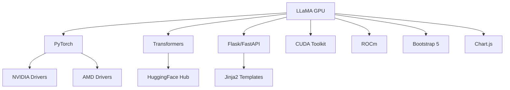
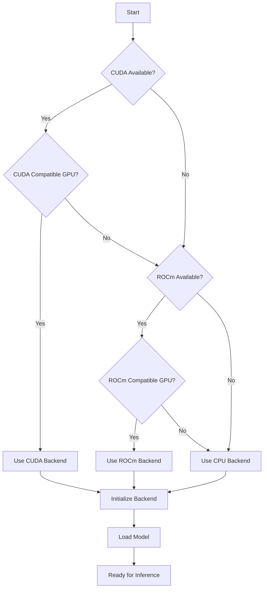
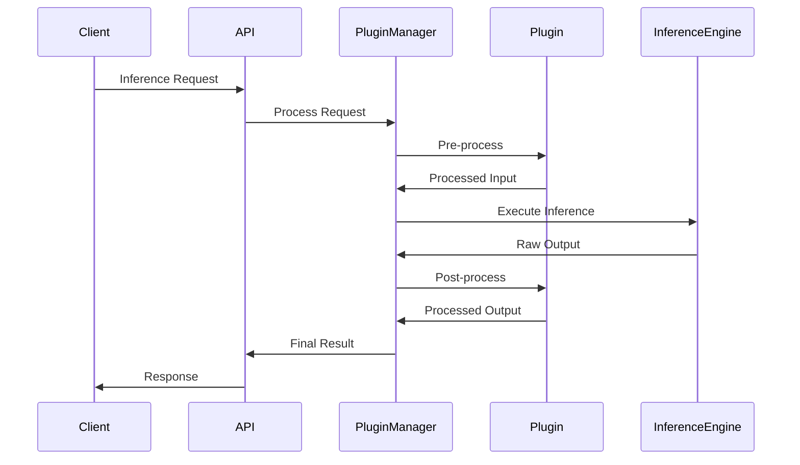
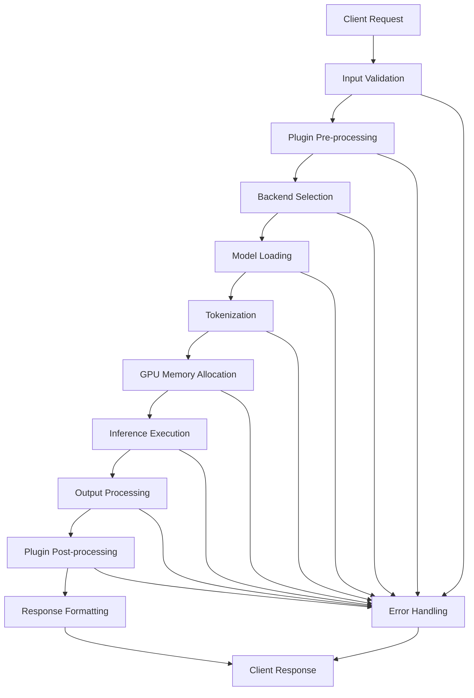
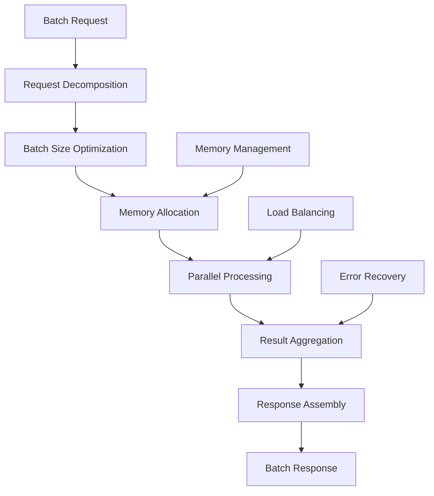
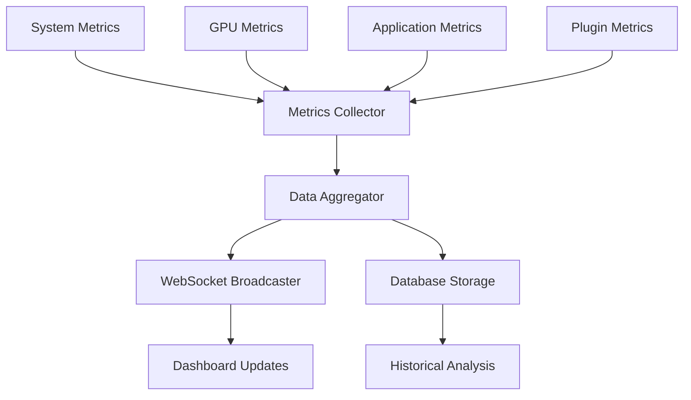

# System Design Document

## Document Information

- **Project**: LLaMA GPU
- **Version**: 1.0.0
- **Last Updated**: August 1, 2025
- **Classification**: Technical Architecture

## Table of Contents

- [1. Introduction](#1-introduction)
- [2. System Overview](#2-system-overview)
- [3. Architecture Design](#3-architecture-design)
- [4. Component Specifications](#4-component-specifications)
- [5. Data Flow Design](#5-data-flow-design)
- [6. Security Design](#6-security-design)
- [7. Performance Design](#7-performance-design)
- [8. Deployment Design](#8-deployment-design)

## 1. Introduction

### 1.1 Purpose

This document describes the technical architecture and design for the LLaMA GPU project, a high-performance GPU-accelerated inference system with web-based management capabilities.

### 1.2 Architecture Goals

- **Performance**: Maximize GPU utilization and inference throughput
- **Scalability**: Support multi-GPU and distributed deployments
- **Extensibility**: Plugin architecture for customization
- **Usability**: Web-based management and monitoring
- **Reliability**: Fault-tolerant operation with graceful degradation

### 1.3 Design Principles

- **Modular Architecture**: Loosely coupled components with well-defined interfaces
- **Asynchronous Processing**: Non-blocking operations for maximum concurrency
- **Resource Optimization**: Intelligent backend selection and load balancing
- **Developer Experience**: Clean APIs and comprehensive documentation

## 2. System Overview

### 2.1 High-Level Architecture

```
┌─────────────────────────────────────────────────────────────┐
│                    LLaMA GPU System                        │
├─────────────────────────────────────────────────────────────┤
│  Web Dashboard    │  REST API Server  │  WebSocket Server  │
├─────────────────────────────────────────────────────────────┤
│                 Core Inference Engine                       │
├─────────────────────────────────────────────────────────────┤
│  Plugin Manager   │  Backend Manager  │  Resource Monitor  │
├─────────────────────────────────────────────────────────────┤
│  CUDA Backend     │  ROCm Backend     │  CPU Backend       │
└─────────────────────────────────────────────────────────────┘
```

### 2.2 System Components

| Component | Purpose | Technology |
|-----------|---------|------------|
| Web Dashboard | User interface for system management | Flask + Bootstrap 5 |
| REST API Server | HTTP API for inference and management | FastAPI / Flask |
| Core Inference Engine | Model loading and inference execution | PyTorch + Transformers |
| Plugin Manager | Dynamic plugin loading and management | Python importlib |
| Backend Manager | GPU/CPU backend selection and optimization | CUDA/ROCm/CPU |
| Resource Monitor | System metrics and performance tracking | psutil + nvidia-ml-py |

### 2.3 External Dependencies



## 3. Architecture Design

### 3.1 Layered Architecture

#### 3.1.1 Presentation Layer
- **Web Dashboard**: Bootstrap-based responsive UI
- **API Gateway**: RESTful endpoints with OpenAPI documentation
- **WebSocket Handler**: Real-time bidirectional communication

#### 3.1.2 Business Logic Layer
- **Inference Orchestrator**: Coordinates model loading and execution
- **Plugin Coordinator**: Manages plugin lifecycle and dependencies
- **Resource Allocator**: Optimizes GPU/CPU resource distribution

#### 3.1.3 Data Access Layer
- **Model Repository**: Manages local and remote model access
- **Configuration Store**: Persistent system configuration
- **Metrics Collector**: Aggregates performance and system metrics

#### 3.1.4 Infrastructure Layer
- **Backend Abstraction**: Unified interface for CUDA/ROCm/CPU
- **Hardware Detection**: Automatic capability discovery
- **Error Handling**: Comprehensive exception management

### 3.2 Plugin Architecture

```
┌─────────────────────────────────────────────────────────────┐
│                    Plugin Ecosystem                        │
├─────────────────────────────────────────────────────────────┤
│  Custom Plugins   │  Model Adapters   │  Output Processors │
├─────────────────────────────────────────────────────────────┤
│                  Plugin Runtime                            │
├─────────────────────────────────────────────────────────────┤
│  Discovery        │  Validation       │  Lifecycle         │
├─────────────────────────────────────────────────────────────┤
│  Isolation        │  Dependency       │  Configuration     │
└─────────────────────────────────────────────────────────────┘
```

#### 3.2.1 Plugin Interface

```python
class BasePlugin:
    def __init__(self, config: dict):
        pass

    def initialize(self) -> bool:
        pass

    def execute(self, input_data: Any) -> Any:
        pass

    def cleanup(self) -> None:
        pass

    @property
    def metadata(self) -> dict:
        pass
```

#### 3.2.2 Plugin Lifecycle

1. **Discovery**: Scan plugin directories for valid modules
2. **Validation**: Check dependencies and compatibility
3. **Loading**: Import and instantiate plugin classes
4. **Registration**: Add to active plugin registry
5. **Execution**: Process requests through plugin chain
6. **Monitoring**: Track performance and health
7. **Unloading**: Clean shutdown and resource release

### 3.3 Backend Architecture

#### 3.3.1 Backend Abstraction Layer

```python
class BaseBackend:
    def initialize(self) -> bool:
        pass

    def load_model(self, model_path: str) -> ModelWrapper:
        pass

    def infer(self, inputs: torch.Tensor) -> torch.Tensor:
        pass

    def get_capabilities(self) -> dict:
        pass

    def get_metrics(self) -> dict:
        pass
```

#### 3.3.2 Backend Selection Logic



## 4. Component Specifications

### 4.1 Core Inference Engine

#### 4.1.1 Model Manager

**Responsibilities:**
- Model loading and caching
- Memory management and optimization
- Model metadata management
- Version control and updates

**Key Methods:**
```python
class ModelManager:
    def load_model(self, model_id: str, backend: str = "auto") -> Model
    def unload_model(self, model_id: str) -> bool
    def get_model_info(self, model_id: str) -> dict
    def optimize_model(self, model: Model, optimization_level: int) -> Model
```

#### 4.1.2 Inference Controller

**Responsibilities:**
- Request routing and load balancing
- Batch processing and optimization
- Result aggregation and formatting
- Error handling and recovery

**Processing Pipeline:**
1. Input validation and preprocessing
2. Backend selection and model loading
3. Inference execution with monitoring
4. Output processing and formatting
5. Response delivery and cleanup

### 4.2 Web Dashboard

#### 4.2.1 Frontend Architecture

**Technology Stack:**
- **Framework**: Bootstrap 5.3.0 for responsive design
- **JavaScript**: Vanilla JS with modern ES6+ features
- **Charts**: Chart.js for data visualization
- **Icons**: Bootstrap Icons for UI elements

**Component Structure:**
```
src/static/
├── css/
│   ├── dashboard.css          # Main dashboard styles
│   ├── themes.css             # Color themes and variants
│   └── responsive.css         # Mobile/tablet optimizations
├── js/
│   ├── dashboard.js           # Main dashboard functionality
│   ├── plugins.js             # Plugin management interface
│   ├── charts.js              # Data visualization components
│   ├── monitoring.js          # Real-time monitoring
│   └── utils.js               # Shared utilities
└── images/
    ├── logos/                 # Brand assets
    └── icons/                 # Custom icons
```

#### 4.2.2 Backend Integration

**Flask Application Structure:**
```python
@app.route('/')
def dashboard():
    return render_template('dashboard/index.html')

@app.route('/api/system/status')
def system_status():
    return jsonify(get_system_metrics())

@socketio.on('monitor_request')
def handle_monitoring(data):
    emit('monitor_data', get_real_time_metrics())
```

### 4.3 API Server Design

#### 4.3.1 REST API Endpoints

| Endpoint | Method | Purpose | Request Format | Response Format |
|----------|--------|---------|----------------|-----------------|
| `/api/infer` | POST | Single inference | JSON with input text | JSON with generated text |
| `/api/batch_infer` | POST | Batch processing | JSON array of inputs | JSON array of outputs |
| `/api/stream_infer` | POST | Streaming inference | JSON with stream config | Server-Sent Events |
| `/api/models` | GET | List available models | Query parameters | JSON model list |
| `/api/plugins` | GET | List plugins | None | JSON plugin list |
| `/api/system/status` | GET | System health | None | JSON status report |

#### 4.3.2 WebSocket API

**Connection Lifecycle:**
1. Client connects to `/socket.io/`
2. Authentication and room assignment
3. Subscription to relevant data streams
4. Real-time data streaming
5. Graceful disconnection handling

**Event Types:**
- `system_metrics`: CPU, GPU, memory usage
- `inference_stats`: Request rates, latencies
- `plugin_events`: Load, unload, error notifications
- `model_events`: Loading progress, status changes

### 4.4 Plugin System Design

#### 4.4.1 Plugin Discovery

**Directory Structure:**
```
plugins/
├── core/                      # Built-in core plugins
│   ├── model_adapter.py
│   ├── output_processor.py
│   └── performance_monitor.py
├── community/                 # Community plugins
│   ├── custom_tokenizer.py
│   ├── response_filter.py
│   └── analytics_collector.py
└── user/                      # User-specific plugins
    ├── custom_plugin.py
    └── experimental_feature.py
```

**Plugin Metadata:**
```python
PLUGIN_METADATA = {
    'name': 'Custom Model Adapter',
    'version': '1.0.0',
    'author': 'Developer Name',
    'description': 'Adapts models for specific use cases',
    'dependencies': ['torch>=2.0.0', 'transformers>=4.30.0'],
    'compatibility': ['cuda', 'rocm', 'cpu'],
    'category': 'model_adapter'
}
```

#### 4.4.2 Plugin Execution Pipeline



## 5. Data Flow Design

### 5.1 Inference Data Flow

#### 5.1.1 Single Inference Request



#### 5.1.2 Batch Processing Flow



### 5.2 Real-time Monitoring Flow

#### 5.2.1 Metrics Collection



#### 5.2.2 Event Streaming

**WebSocket Data Format:**
```json
{
    "timestamp": "2025-01-01T12:00:00Z",
    "event_type": "system_metrics",
    "data": {
        "cpu_usage": 45.2,
        "memory_usage": 67.8,
        "gpu_usage": 89.1,
        "gpu_memory": 78.5,
        "active_requests": 12,
        "requests_per_second": 15.7
    }
}
```

## 6. Security Design

### 6.1 Authentication Architecture

#### 6.1.1 Multi-Layer Security

```
┌─────────────────────────────────────────────────────────────┐
│                    Security Layers                         │
├─────────────────────────────────────────────────────────────┤
│  Web UI           │  API Keys         │  Role-Based        │
│  Sessions         │  Authentication   │  Authorization     │
├─────────────────────────────────────────────────────────────┤
│  Input Validation │  Rate Limiting    │  Audit Logging     │
├─────────────────────────────────────────────────────────────┤
│  HTTPS/TLS        │  CORS Protection  │  CSRF Protection   │
└─────────────────────────────────────────────────────────────┘
```

#### 6.1.2 Role-Based Access Control

**User Roles:**
- **Admin**: Full system access, plugin management, configuration
- **Operator**: Inference operations, monitoring, basic configuration
- **User**: Inference access only, read-only monitoring
- **Guest**: Limited read-only access

**Permission Matrix:**
| Resource | Admin | Operator | User | Guest |
|----------|-------|----------|------|-------|
| System Configuration | RW | R | - | - |
| Plugin Management | RW | RW | R | R |
| Model Management | RW | RW | R | R |
| Inference Operations | RW | RW | RW | - |
| Monitoring Data | RW | R | R | R |

### 6.2 Data Protection

#### 6.2.1 Input Sanitization

```python
def validate_inference_input(data: dict) -> dict:
    # Input length validation
    if len(data.get('text', '')) > MAX_INPUT_LENGTH:
        raise ValidationError("Input text too long")

    # Content filtering
    sanitized_text = html.escape(data['text'])

    # Parameter validation
    max_tokens = min(data.get('max_tokens', 100), MAX_ALLOWED_TOKENS)

    return {
        'text': sanitized_text,
        'max_tokens': max_tokens,
        'temperature': max(0.1, min(2.0, data.get('temperature', 1.0)))
    }
```

#### 6.2.2 API Security

**Rate Limiting Configuration:**
```python
RATE_LIMITS = {
    'inference': '100/minute',
    'batch_inference': '10/minute',
    'plugin_operations': '30/minute',
    'system_queries': '300/minute'
}
```

## 7. Performance Design

### 7.1 Optimization Strategies

#### 7.1.1 Memory Management

**GPU Memory Optimization:**
- Dynamic batch sizing based on available memory
- Model quantization (FP16, INT8) for memory efficiency
- Gradient checkpointing for large models
- Memory pooling and reuse

**CPU Memory Optimization:**
- Object pooling for frequent allocations
- Lazy loading of model components
- Efficient data structures and algorithms
- Memory-mapped file access for large datasets

#### 7.1.2 Compute Optimization

**GPU Acceleration:**
- Tensor parallelism across multiple GPUs
- Pipeline parallelism for sequential operations
- Mixed precision training and inference
- CUDA kernel optimization

**CPU Optimization:**
- Multi-threading for I/O operations
- Vectorized operations with NumPy
- Process pooling for CPU-intensive tasks
- Cache optimization for frequently accessed data

### 7.2 Performance Monitoring

#### 7.2.1 Metrics Collection

**System Metrics:**
- CPU usage, memory usage, disk I/O
- GPU utilization, GPU memory, temperature
- Network traffic, bandwidth utilization
- Process-level resource consumption

**Application Metrics:**
- Request latency (p50, p95, p99)
- Throughput (requests/second)
- Error rates and types
- Queue lengths and wait times

#### 7.2.2 Performance Benchmarking

**Benchmark Suite:**
```python
class PerformanceBenchmark:
    def benchmark_single_inference(self, model, inputs):
        """Measure single request latency"""

    def benchmark_batch_inference(self, model, batch_sizes):
        """Measure batch throughput"""

    def benchmark_concurrent_load(self, num_threads, duration):
        """Measure concurrent performance"""

    def benchmark_memory_usage(self, model_sizes):
        """Measure memory efficiency"""
```

## 8. Deployment Design

### 8.1 Containerization

#### 8.1.1 Docker Architecture

**Multi-Stage Dockerfile:**
```dockerfile
# Build stage
FROM python:3.9-slim as builder
COPY requirements.txt .
RUN pip install --user -r requirements.txt

# Runtime stage
FROM nvidia/cuda:11.8-runtime-ubuntu20.04
COPY --from=builder /root/.local /root/.local
COPY . /app
WORKDIR /app
EXPOSE 5000
CMD ["python", "app.py"]
```

**Container Orchestration:**
- **Development**: Docker Compose for local development
- **Production**: Kubernetes for orchestration and scaling
- **Cloud**: Support for AWS ECS, Google Cloud Run, Azure Container Instances

#### 8.1.2 Configuration Management

**Environment Variables:**
```yaml
# docker-compose.yml
services:
  llama-gpu:
    environment:
      - LLAMA_BACKEND=cuda
      - LLAMA_MODEL_PATH=/models
      - LLAMA_MAX_MEMORY=80%
      - LLAMA_PLUGIN_PATH=/plugins
      - LLAMA_LOG_LEVEL=INFO
```

### 8.2 Production Deployment

#### 8.2.1 High Availability Setup

```
┌─────────────────────────────────────────────────────────────┐
│                    Load Balancer                           │
├─────────────────────────────────────────────────────────────┤
│  Instance 1       │  Instance 2       │  Instance 3        │
│  (Primary)        │  (Secondary)      │  (Secondary)       │
├─────────────────────────────────────────────────────────────┤
│                  Shared Storage                            │
│              (Models, Plugins, Config)                     │
├─────────────────────────────────────────────────────────────┤
│                   Monitoring                               │
│            (Prometheus + Grafana)                          │
└─────────────────────────────────────────────────────────────┘
```

#### 8.2.2 Scaling Considerations

**Horizontal Scaling:**
- Stateless application design
- Shared model storage (NFS, S3)
- Load balancer configuration
- Database connection pooling

**Vertical Scaling:**
- GPU memory scaling
- CPU and RAM upgrades
- Storage performance optimization
- Network bandwidth requirements

---

**Document Status**: Complete
**Architecture Review**: Quarterly
**Implementation Status**: ✅ Implemented
**Next Review**: Q2 2025
